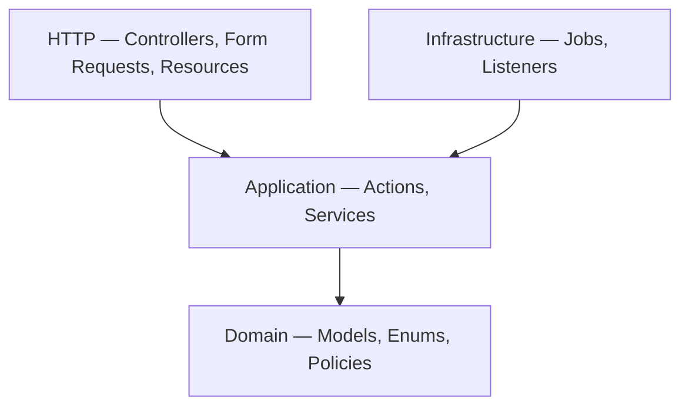

# Coding Conventions

Clean, Laravel-native patterns for LanceHive. Prefer simple, explicit code over abstraction.

---

## PHP baseline

Every PHP file:

```php
<?php

declare(strict_types=1);

namespace App\Features\Delivery\Http\Controllers;

final class ClientController extends Controller
{
    public function store(StoreClientRequest $request, CreateClientAction $action): ClientResource
    {
        return new ClientResource($action->execute($request->validated()));
    }
}
```

| Rule | Detail |
|------|--------|
| Strict types | `declare(strict_types=1);` at top of every file |
| Final classes | Use `final` unless the class is designed for extension |
| Return types | Explicit on all methods, including `void` |
| Parameter types | Type-hint all parameters |
| DI | Constructor property promotion — no empty constructors |
| Curly braces | Always, even for single-line bodies |

---

## Formatting

Run Pint before finishing any PHP change:

```bash
vendor/bin/sail bin pint --dirty --format agent
```

No project `pint.json` — Laravel Pint defaults apply.

---

## Models (Laravel 13)

Use attribute-based configuration and the `casts()` method:

```php
#[Fillable(['freelancer_id', 'name', 'status'])]
final class Client extends Model
{
    protected function casts(): array
    {
        return [
            'status' => ClientStatus::class,
        ];
    }
}
```

| Do | Don't |
|----|-------|
| `casts()` method | `$casts` property |
| `#[Fillable]` / `#[Hidden]` attributes | `$fillable` / `$hidden` properties |
| Backed enums in `Enums/` | Magic strings in models |
| Factory in `database/factories/{Feature}/` | Flat `database/factories/` |
| `newFactory()` pointing to feature factory | Default factory namespace |

Enum keys use **TitleCase** (`InProgress`, `Active`, `Monthly`).

---

## Layer responsibilities

Dependencies flow **downward only**.



| Layer | Contains | May call | Must NOT contain |
|-------|----------|----------|------------------|
| HTTP | Controllers, Form Requests, API Resources | Application, Domain (type hints) | Business rules, `DB::`, plan limits, invoice math |
| Application | Actions (one use case), Services (orchestration) | Domain, Core | `Request`, `Response`, route names |
| Domain | Models, Enums, Policies, domain exceptions | Same or lower modules | Foreign feature services |
| Infrastructure | Jobs, listeners, feature middleware | Application, Domain | Controller logic |

---

## Controller pattern (thin)

```php
final class ProjectController extends Controller
{
    public function store(StoreProjectRequest $request, CreateProjectAction $action): ProjectResource
    {
        $project = $action->execute($request->validated());

        return new ProjectResource($project);
    }
}
```

- Validation → **Form Request** only (Scramble infers request schema)
- Response → **API Resource** only (not raw arrays or `response()->json()`)
- Authorization → **Policy** (called from Form Request, Action, or controller gate)
- Scramble → `#[Group('…', weight: N)]` on controller class

---

## Action pattern (single use case)

```php
final class CreateProjectAction
{
    public function __construct(
        private readonly PlanLimitService $planLimits,
        private readonly TenantContext $tenant,
    ) {}

    public function execute(array $data): Project
    {
        $this->planLimits->assertCanCreateProject($this->tenant->freelancerId());

        // validate client belongs to tenant, create, dispatch events…
    }
}
```

Prefer **Actions** for CRUD and single operations. Use **Services** for multi-step workflows (billing, webhooks, Stripe).

Method name: `execute()` (consistent across the codebase).

---

## API errors

Business and auth errors:

```php
throw new ApiException(ApiErrorCode::PlanLimitExceeded, 'Maximum clients reached.');
```

Validation errors use Laravel's default `422` shape (no custom `code` field).

Strategy: [error-handling.md](./error-handling.md) · Catalog: [api/errors.md](../api/errors.md) · Rule: `error-handling.mdc`

---

## Database & queries

| Concern | Rule |
|---------|------|
| Tenant filtering | Global scope in `Core/Tenancy/` — not manual `where freelancer_id` in controllers |
| Authorization | Policies — not inline role checks in controllers — see [security-and-auth.md](./security-and-auth.md) |
| Plan limits | `PlanLimitService` with `lockForUpdate` |
| Invoice math | `ClientInvoiceService` only |
| List pagination | `cursorPaginate()` — default 25, max 100 |
| Aggregates | SQL `SUM()` or service methods — never load all rows into a Collection |
| Migrations | One concern per file; see [postgres-laravel13 rule](../../.cursor/rules/postgres-laravel13.mdc) |

Money: `decimal(12,2)` totals, `decimal(8,2)` hours. Currency default `BDT`.

---

## Comments & PHPDoc

- Code should be self-explanatory — avoid narrating what the code does
- PHPDoc for non-obvious array shapes, generics on relations, and factory `@use` tags
- No inline comments unless the business rule is genuinely non-obvious

---

## Dependencies

Do **not** add Composer or npm packages without explicit approval.

Check installed versions before using package APIs:

```bash
vendor/bin/sail composer show --direct
vendor/bin/sail composer show laravel/framework
```

---

## Verification workflow

After every code change:

1. Run the **narrowest** Pest file covering the change
2. Run Pint on dirty PHP
3. For new API routes: assert path in `tests/Feature/Api/DocumentationTest.php`

See [testing-strategy.md](./testing-strategy.md), [testing-required rule](../../.cursor/rules/testing-required.mdc), `lancehive-guardrails`, and `lancehive-testing` skills.
