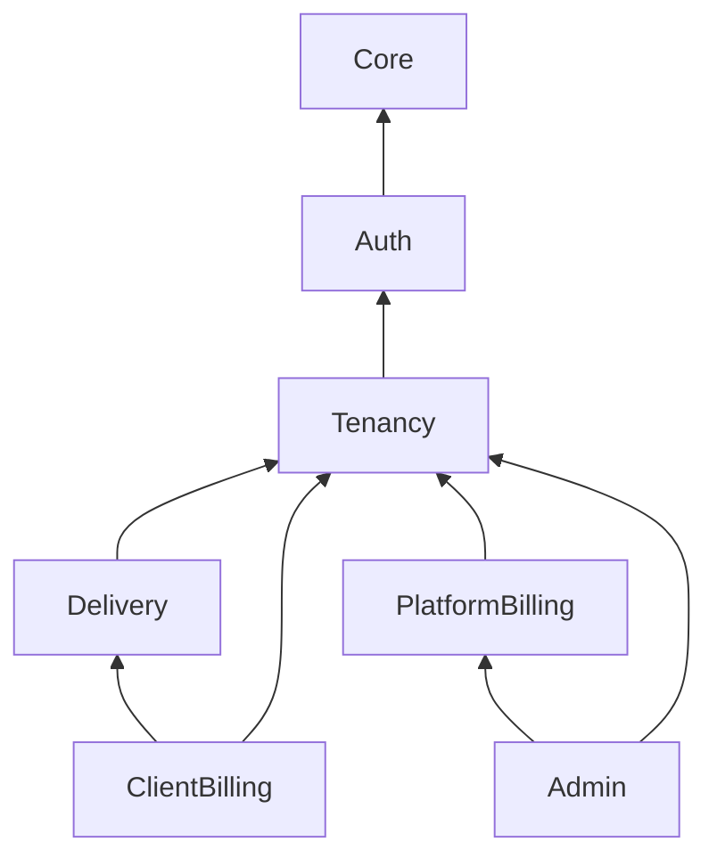

# Naming & Folder Rules

Where files live, how they are named, and which modules may import each other.

---

## Top-level layout

```
lancehive/
├── app/
│   ├── Core/                         # Shared infrastructure (no business rules)
│   └── Features/                     # Business vertical slices
├── config/                           # Laravel + api.php, scramble.php
├── database/
│   ├── factories/{Feature}/          # Grouped by feature
│   ├── migrations/                   # Flat, timestamped
│   └── seeders/
├── routes/
│   ├── api.php                       # Version loader
│   └── features/v1/                  # One file per feature module
├── tests/
│   ├── Feature/{Feature}/            # HTTP tests — mirror Features/
│   └── Unit/{Feature}/               # Pure logic tests
├── docs/
├── compose.yaml                      # Sail: PHP 8.5, PostgreSQL 18, Redis, Mailpit
└── phpunit.xml                       # Test env overrides
```

**Do not** create new top-level folders under `app/` without approval.

---

## Feature folder template

```
app/Features/{FeatureName}/
├── Actions/
├── Services/
├── Http/
│   ├── Controllers/
│   ├── Requests/
│   └── Resources/
├── Models/
├── Enums/
├── Policies/
├── Jobs/                             # Create when first file appears
├── Events/                           # Optional
├── Listeners/                        # Optional
└── Exceptions/                       # Optional
```

Create subfolders when the first file appears — do not scaffold empty directories.

---

## Feature catalog

| Feature | Namespace | Owns (models) | Route file |
|---------|-----------|---------------|------------|
| Auth | `App\Features\Auth` | `User` | `routes/features/v1/auth.php` |
| Tenancy | `App\Features\Tenancy` | `Freelancer`, `FreelancerMembership` | `tenancy.php` |
| Delivery | `App\Features\Delivery` | `Client`, `Project`, `Task`, `TimeLog` | `delivery.php` |
| ClientBilling | `App\Features\ClientBilling` | `ClientInvoice*` | `client-billing.php` |
| PlatformBilling | `App\Features\PlatformBilling` | `Plan`, `Subscription*` | `platform-billing.php` |
| Admin | `App\Features\Admin` | `AdminActivityLog` | `admin.php` |
| ClientPortal | `App\Features\ClientPortal` | `ClientMembership` | `portal.php` (Phase 14) |

PSR-4 namespace must match folder path: `App\Features\Delivery\Models\Client` → `app/Features/Delivery/Models/Client.php`.

---

## Naming table

| Artifact | Pattern | Example |
|----------|---------|---------|
| Controller | `{Entity}Controller` | `TimeLogController` |
| Form request | `{Verb}{Entity}Request` | `StoreTimeLogRequest` |
| API resource | `{Entity}Resource` | `TimeLogResource` |
| Collection resource | `{Entity}CollectionResource` | `UserCollectionResource` |
| Action | `{Verb}{Entity}Action` | `LogTimeAction` |
| Service | `{Entity}Service` | `SubscriptionService` |
| Policy | `{Entity}Policy` | `ClientInvoicePolicy` |
| Job | `{Verb}{Entity}Job` | `MarkOverdueClientInvoicesJob` |
| Enum | `{Entity}{Attribute}` | `ClientInvoiceStatus` |
| Model | Singular PascalCase | `ClientInvoiceItem` |
| Exception | `{Description}Exception` | — |
| Unit test | `{Entity}Test` | `ClientTest` |
| Feature test | `{Endpoint}Test` or `{Entity}CrudTest` | `StoreClientTest` |
| Isolation test | `{Entity}IsolationTest` | `ClientIsolationTest` |

Route names and URI segments use **kebab-case** (`time-logs`, `client-invoices`).

---

## `app/Core/` — shared infrastructure

```
app/Core/
├── Http/
│   ├── Middleware/          # EnsureFreelancerContext, EnsureWritableSubscription
│   ├── Enums/               # ApiErrorCode
│   └── Exceptions/          # ApiException
├── Tenancy/                 # TenantContext, BelongsToFreelancer, scopes
├── Cache/                   # PlanCache, SubscriptionCache, MembershipCache
├── Pagination/              # Cursor pagination meta
└── Support/                 # AdminActivityLogger
```

**Rules:**

- Core **never** imports `App\Features\*`
- Tenant **filtering** in Core; tenant **authorization** in Policies
- Features depend on Core, never the reverse

---

## API versioning vs folders

| Versioned | Not versioned |
|-----------|---------------|
| `routes/features/v1/*.php` | `app/Features/{Feature}/` |
| URL prefix `/api/v1` | Actions, Services, Models, Enums |
| Scramble `api_path` | `database/migrations`, factories, seeders |
| — | `tests/Feature/{Feature}/` |

Config: `config/api.php` · env `API_ROUTE_VERSION=v1`.

**Do not** add `V1/` subfolders under `app/Features/` while only one API version exists.

When v2 is needed: copy changed route files to `routes/features/v2/`; duplicate controllers only when HTTP contract breaks. Freeze v1.

Tests use `$this->apiUrl('clients')` → `/api/v1/clients` — never hardcode the prefix.

---

## Module dependency rules

Mandatory — no circular or upward imports.



| Feature | May import from | Must NOT import from |
|---------|-----------------|----------------------|
| Auth | Core | Any other Feature |
| Tenancy | Auth, Core | Delivery, Billing |
| Delivery | Tenancy, Core | ClientBilling, PlatformBilling |
| ClientBilling | Delivery, Tenancy, Core | PlatformBilling |
| PlatformBilling | Tenancy, Core | ClientBilling, Delivery |
| Admin | All features **via services only** | Direct foreign models in controllers |
| ClientPortal | Tenancy, Delivery (read), Core | ClientBilling writes, PlatformBilling |

Prefer constructor injection of allowed services. Do not query another feature's models from a foreign Service — expose an Action or query method in the owning feature.

---

## Database folders

```
database/
├── factories/
│   ├── Auth/UserFactory.php
│   ├── Tenancy/FreelancerFactory.php
│   └── Delivery/ClientFactory.php
├── migrations/                       # Flat — Laravel convention
└── seeders/
    ├── DatabaseSeeder.php
    └── PlanSeeder.php
```

Migration namespace: `Database\Factories\{Feature}\{Model}Factory`.

Factories use **states** for common variants: `active()`, `draft()`, `freelancer()`.

---

## Test folders

Mirror feature names — **not** API version:

```
tests/
├── Feature/
│   ├── Auth/LoginTest.php
│   ├── Delivery/StoreClientTest.php
│   ├── Tenancy/FreelancerIsolationTest.php
│   └── Api/DocumentationTest.php
└── Unit/
    ├── Core/ApiErrorCodeTest.php
    └── Delivery/ClientTest.php
```

Create tests with:

```bash
vendor/bin/sail artisan make:test --pest StoreClientTest
vendor/bin/sail artisan make:test --pest ClientTest --unit
```

---

## Route file pattern

```php
// routes/features/v1/delivery.php
Route::middleware([
    'auth:sanctum',
    EnsureFreelancerContext::class,
    EnsureWritableSubscription::class,
])->group(function () {
    Route::post('/clients', [ClientController::class, 'store']);
});
```

Read-only GET routes skip `EnsureWritableSubscription`.

Register new route files in `routes/api.php` via `config('api.features_routes')`.

---

## Billing name guardrails

Never mix client billing and platform billing names:

| Client billing | Platform billing |
|----------------|------------------|
| `ClientInvoice` | `Plan` |
| `ClientInvoiceItem` | `Subscription` |
| `ClientInvoicePayment` | `SubscriptionCharge` |

---

## Checklist for new work

- [ ] Files under correct `App\Features\{Name}\` namespace
- [ ] Controller delegates to Action or Service
- [ ] Form Request for validation; Policy for authorization
- [ ] Tenant scope on tenant-owned models
- [ ] No forbidden cross-feature imports
- [ ] Route in `routes/features/v1/{feature}.php`
- [ ] Factory in `database/factories/{Feature}/`
- [ ] Feature + unit tests; Scramble path assertion for new routes
