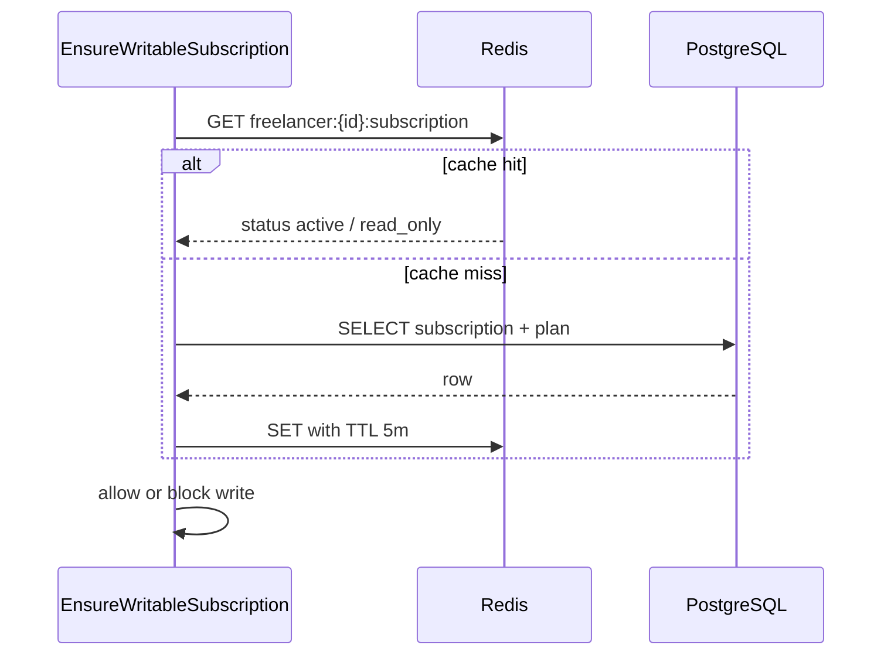
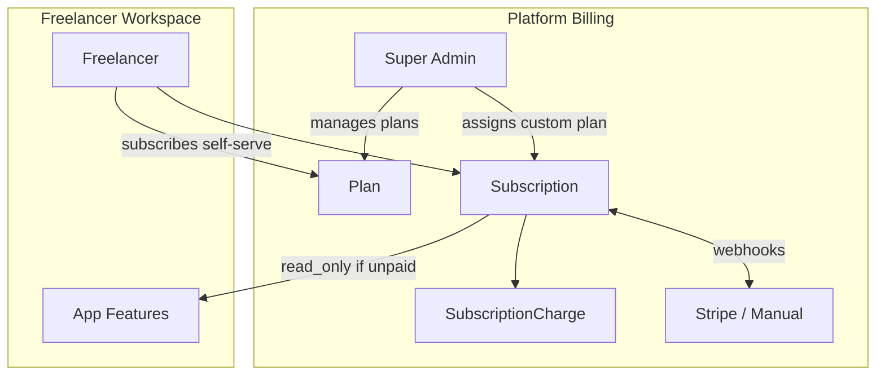
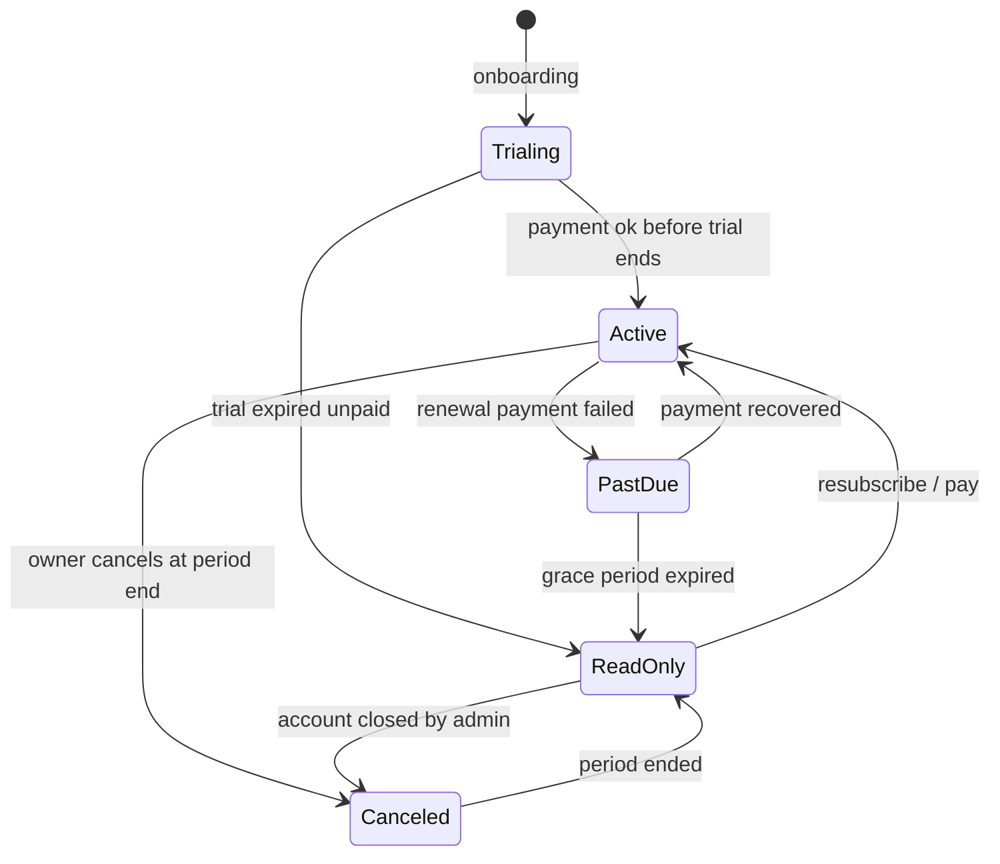
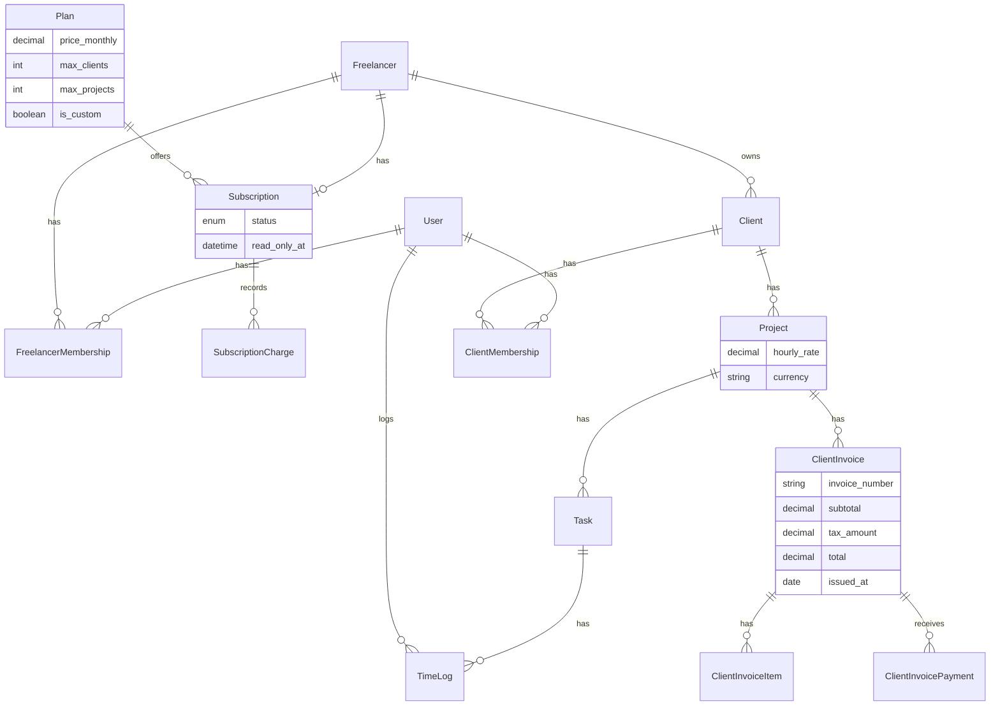

# Architecture Overview

## Domain hierarchy

```
Platform (Super Admin)
├── Plan / Subscription          ← freelancer pays LanceHive (monthly / yearly)
└── Freelancer (tenant / workspace)
    └── Client (customer organization)
        └── Project  (hourly_rate set at project creation)
            ├── Task
            │   └── TimeLog (logged by User)
            └── ClientInvoice (freelancer bills client)
                ├── ClientInvoiceItem
                └── ClientInvoicePayment  (record-only for now; bKash/bank later)
```

## Naming convention (two billing layers)

Use distinct names so client billing and platform billing never collide in code or conversation.

| Layer | Who pays whom | Models | Tables |
|-------|---------------|--------|--------|
| **Platform billing** | Freelancer → LanceHive | `Plan`, `Subscription`, `SubscriptionCharge` | `plans`, `subscriptions`, `subscription_charges` |
| **Client billing** | Client → Freelancer | `ClientInvoice`, `ClientInvoiceItem`, `ClientInvoicePayment` | `client_invoices`, `client_invoice_items`, `client_invoice_payments` |

Do **not** use generic names like `Invoice` or `Payment` alone — they are ambiguous (Stripe subscription invoices vs client invoices).

---

## Core entities

### Tenancy and org structure

| Entity | Table | Purpose |
|--------|-------|---------|
| Freelancer | `freelancers` | Tenant workspace. All tenant data scoped here. |
| FreelancerMembership | `freelancer_memberships` | Links users to a workspace (`owner`, `admin`, `member`). |
| Client | `clients` | End-customer org under one freelancer. Not a login user. |
| ClientMembership | `client_memberships` | Client portal users linked to a client org (Phase 14). |

### Project delivery

| Entity | Table | Purpose |
|--------|-------|---------|
| Project | `projects` | Work engagement under one client. Includes `hourly_rate` agreed at setup. |
| Task | `tasks` | Unit of work inside a project. |
| TimeLog | `time_logs` | Hours logged by a workspace member against a task. |

### Client billing (freelancer bills their clients)

| Entity | Table | Purpose |
|--------|-------|---------|
| ClientInvoice | `client_invoices` | Bill sent to a client for work on a project. |
| ClientInvoiceItem | `client_invoice_items` | Line item (description, qty, rate, amount). |
| ClientInvoicePayment | `client_invoice_payments` | Manual record that client paid (MVP: record-only). |

### Platform subscriptions (freelancer pays LanceHive)

| Entity | Table | Purpose |
|--------|-------|---------|
| Plan | `plans` | Pricing tier with monthly/yearly prices and resource limits. |
| Subscription | `subscriptions` | Active billing relationship for a freelancer workspace. |
| SubscriptionCharge | `subscription_charges` | Record of each platform charge (from payment provider webhooks). |

---

## Business decisions (locked in)

| Topic | Decision |
|-------|----------|
| **Billable rate** | `hourly_rate` on **Project**, entered when freelancer creates a project for a client. Used when generating invoice line items from time logs. |
| **Client payments** | **Record-only** in MVP (mark invoice paid, log amount + method). Automated collection via **bank transfer** or **bKash** — Phase 16+. |
| **Subscription lapse** | Expired / unpaid subscription → workspace is **read-only** (view data, export); no create/update/delete until renewed. |
| **Plan limits** | Limits on **clients**, **projects**, **team members**, etc. per plan. Priced in **BDT**. |
| **Custom plan** | `is_custom = true` — not self-serve; freelancer contacts super-admin; super-admin assigns unlimited (or negotiated) limits manually. |

---

## Entity schemas

### Project

Belongs to **Client** and **Freelancer** (denormalized `freelancer_id` for tenant scoping).

| Column | Type | Notes |
|--------|------|-------|
| `id` | bigint PK | |
| `client_id` | FK → clients | Required |
| `freelancer_id` | FK → freelancers | Auto-set from tenant context |
| `name` | string | |
| `hourly_rate` | decimal(12,2) | Billable rate for this project — set at project creation (client/agreement input) |
| `currency` | string(3) | Default `BDT` |
| `status` | enum | `active`, `on_hold`, `completed` |
| `deadline` | date, nullable | |
| `deleted_at` | timestamp | Soft deletes |
| `timestamps` | | |

**Time log → invoice:** unbilled hours × `project.hourly_rate` → `ClientInvoiceItem` (Phase 16.5).

### Task

Belongs to **Project**. Tenant scope inherited via `project.freelancer_id`.

| Column | Type | Notes |
|--------|------|-------|
| `id` | bigint PK | |
| `project_id` | FK → projects | Required |
| `title` | string | |
| `status` | enum | `todo`, `in_progress`, `done` |
| `due_date` | date, nullable | |
| `estimated_hours` | decimal(8,2), nullable | |
| `deleted_at` | timestamp | Soft deletes |
| `timestamps` | | |

### TimeLog

Belongs to **Task** and **User** (who logged the time).

| Column | Type | Notes |
|--------|------|-------|
| `id` | bigint PK | |
| `task_id` | FK → tasks | Required |
| `user_id` | FK → users | Workspace member who logged time |
| `hours` | decimal(8,2) | |
| `description` | text, nullable | |
| `logged_at` | datetime | When the work was performed |
| `client_invoice_item_id` | FK, nullable | Set when hours are billed on a `ClientInvoiceItem` (prevents double-billing) |
| `timestamps` | | |

### ClientInvoice

Belongs to **Project**. Freelancer-to-client billing only.

| Column | Type | Notes |
|--------|------|-------|
| `id` | bigint PK | |
| `freelancer_id` | FK → freelancers | For tenant scoping and unique invoice numbers per workspace |
| `project_id` | FK → projects | Required |
| `invoice_number` | string | Unique per freelancer, e.g. `INV-2026-0001` — auto-generated on create |
| `status` | enum | `draft`, `sent`, `paid`, `overdue`, `void` |
| `currency` | string(3) | Default `BDT`; snapshot from project at issue time |
| `subtotal` | decimal(12,2) | Sum of line items before tax |
| `tax_rate` | decimal(5,2), nullable | e.g. `0.00` if no VAT |
| `tax_amount` | decimal(12,2) | Computed |
| `total` | decimal(12,2) | `subtotal + tax_amount` — stored snapshot |
| `issued_at` | date, nullable | Invoice date (set when status → `sent`) |
| `due_date` | date, nullable | Payment due |
| `sent_at` | datetime, nullable | When sent to client |
| `paid_at` | datetime, nullable | When fully paid (all payments ≥ total) |
| `notes` | text, nullable | Footer / payment instructions shown to client |
| `bill_to_name` | string | Snapshot from client at issue time |
| `bill_to_email` | string, nullable | Snapshot from client |
| `bill_to_address` | text, nullable | Optional billing address snapshot |
| `deleted_at` | timestamp | Soft deletes (draft only) |
| `timestamps` | | |

**Invoice number generation:** sequential per `freelancer_id`, e.g. `INV-{YYYY}-{sequence}`.

### ClientInvoiceItem

Belongs to **ClientInvoice**.

| Column | Type | Notes |
|--------|------|-------|
| `id` | bigint PK | |
| `client_invoice_id` | FK → client_invoices | Required |
| `description` | string | e.g. "Development — March 2026" or task title |
| `quantity` | decimal(10,2) | Hours or units |
| `rate` | decimal(12,2) | Usually `project.hourly_rate` when generated from time logs |
| `amount` | decimal(12,2) | `quantity × rate` |
| `timestamps` | | |

### ClientInvoicePayment

Manual payment record — client paid the freelancer (not platform billing).

| Column | Type | Notes |
|--------|------|-------|
| `id` | bigint PK | |
| `client_invoice_id` | FK → client_invoices | Required |
| `amount` | decimal(12,2) | |
| `payment_method` | enum | MVP: `manual`, `bank_transfer`, `cash`, `other`. Phase 16+: `bkash` |
| `reference` | string, nullable | Transaction ID, bank ref, bKash trxID (future) |
| `paid_at` | datetime | |
| `notes` | text, nullable | |
| `timestamps` | | |

**MVP:** Freelancer manually records payment after client pays offline.  
**Future (Phase 16):** bKash / bank transfer integration — same table, richer `payment_method` + webhook confirmation.

### Plan

Platform pricing. Managed by super-admin.

| Column | Type | Notes |
|--------|------|-------|
| `id` | bigint PK | |
| `name` | string | e.g. "Starter", "Pro", "Custom" |
| `slug` | string, unique | |
| `price_monthly` | decimal(10,2) | BDT — nullable for custom plans |
| `price_yearly` | decimal(10,2) | BDT — nullable for custom plans |
| `currency` | string(3) | Default `BDT` |
| `max_clients` | integer, nullable | `null` = unlimited (custom plans) |
| `max_projects` | integer, nullable | `null` = unlimited |
| `max_team_members` | integer, nullable | `null` = unlimited |
| `is_custom` | boolean | `true` = not self-serve; contact super-admin |
| `is_active` | boolean | Visible for new signups |
| `sort_order` | integer | Display order on pricing page |
| `timestamps` | | |

**Example plans (BDT):**

| Plan | Monthly | Clients | Projects | Team | Self-serve |
|------|---------|---------|----------|------|------------|
| Starter | 200 | 3 | 5 | 1 | Yes |
| Pro | 500 | 10 | 25 | 3 | Yes |
| Business | 1,200 | 30 | 100 | 10 | Yes |
| Custom | Contact | Unlimited | Unlimited | Negotiated | No — super-admin assigns |

Enforce via `PlanLimitService` before create actions (clients, projects, members).

### Subscription

One active subscription per freelancer workspace.

| Column | Type | Notes |
|--------|------|-------|
| `id` | bigint PK | |
| `freelancer_id` | FK → freelancers | |
| `plan_id` | FK → plans | |
| `status` | enum | `trialing`, `active`, `past_due`, `read_only`, `canceled` |
| `billing_interval` | enum | `monthly`, `yearly` — nullable during trial |
| `trial_ends_at` | datetime, nullable | |
| `current_period_start` | datetime, nullable | |
| `current_period_end` | datetime, nullable | |
| `read_only_at` | datetime, nullable | When workspace was downgraded to read-only |
| `canceled_at` | datetime, nullable | |
| `provider` | string | e.g. `stripe`, `manual` (custom plans billed manually) |
| `provider_subscription_id` | string, nullable | |
| `timestamps` | | |

### SubscriptionCharge

Platform charge record (freelancer paid LanceHive — not client billing).

| Column | Type | Notes |
|--------|------|-------|
| `id` | bigint PK | |
| `subscription_id` | FK → subscriptions | |
| `amount` | decimal(10,2) | |
| `currency` | string(3) | Default `BDT` |
| `status` | enum | `pending`, `paid`, `failed` |
| `paid_at` | datetime, nullable | |
| `provider_charge_id` | string, nullable | Stripe payment intent / invoice ID |
| `timestamps` | | |

---

## Application layer rules

Where business logic lives — avoid wrong-layer anti-patterns. Full audit: [architecture-review.md](./architecture-review.md).

| Concern | Layer |
|---------|-------|
| Tenant filtering (`freelancer_id`) | Eloquent global scope only |
| Who can do what | Policies + Gates |
| Plan limits (max clients/projects) | `PlanLimitService` |
| Subscription read-only | `EnsureWritableSubscription` middleware |
| Invoice totals, numbering, billing time logs | `ClientInvoiceService` |
| Stripe / subscription state | `SubscriptionService` + webhooks |
| Overdue invoices | Queued job, not DB trigger |

**Module dependency (no cycles):** Auth → Tenancy → Delivery → Client Billing · Platform Billing → Tenancy only.

**Do not:** put plan limits in SQL CHECK constraints, subscription checks in every controller, or invoice math in database triggers.

---

## Tenancy strategy (MVP)

- **Single database** with `freelancer_id` on directly tenant-owned tables (`clients`, `projects`, `client_invoices`).
- **Indirect scoping** for nested models (`tasks`, `time_logs`, `client_invoice_items`) via project/invoice chain.
- **`TenantContext`** service holds active `freelancer_id` for the request.
- **`BelongsToFreelancer`** trait on `Client`, `Project`, `ClientInvoice`.
- **`EnsureFreelancerContext`** middleware resolves tenant from membership or super-admin override.
- **`EnsureWritableSubscription`** middleware blocks **writes** when subscription is not active/trialing; **reads always allowed**.

Full rationale, growth path, and weakness mitigations: [design-rationale-and-scaling.md](./design-rationale-and-scaling.md).

### MVP guardrails (scale-smooth, not scale-big)

Build these from Phase 2 — they cost little now and avoid rewrites later:

| Guardrail | Rule |
|-----------|------|
| Tenant queries | Eloquent + global scopes only; no unscoped `DB::table` in HTTP layer |
| List APIs | Cursor pagination; default 25, max 100 per page |
| Time logs | Always paginated; never load full history into memory for totals |
| Plan limits | `PlanLimitService` inside transaction with row lock on subscription |
| Heavy work | Queued jobs (overdue invoices, future reports) — not in request cycle |
| Admin override | Super-admin `?freelancer_id=` actions logged to `admin_activity_logs` |
| Files | PDFs/assets on disk/S3 path — not in database blobs |
| Cache | Redis for plans/subscription/memberships; PostgreSQL is data only |

---

## API versioning

All HTTP API routes are versioned under **`/api/v1`**.

| Setting | Purpose |
|---------|---------|
| `API_ROUTE_VERSION` (`.env`, default `v1`) | URL segment — routes resolve to `/api/v1/...` |
| `config/api.php` | `route_version`, `prefix` (`api/v1`), `features_routes` (`routes/features/v1`) |
| OpenAPI `info.version` (`API_VERSION`) | Documentation semver only — not the URL segment |

**What is versioned in the filesystem:**

| Versioned | Not versioned |
|-----------|---------------|
| `routes/features/v1/*.php` | `app/Features/{Feature}/` (controllers, models, actions) |
| URL prefix `/api/v1` | `database/migrations`, factories, seeders |
| Scramble `api_path` | `tests/Feature/{Feature}/` — use `$this->apiUrl()` |

**Rules:**

- New endpoints → add route in `routes/features/v1/{feature}.php`; wire controller from `app/Features/`.
- Do **not** add `V1/` under `app/Features/` while only one API version exists.
- Scramble documents `api/v1` at `/docs/api` (OpenAPI paths relative, e.g. `/login`).
- Future `v2`: `routes/features/v2/` + optional `V2/` controllers only where HTTP contracts diverge; freeze v1.

Full folder rules: [feature-based-architecture.md §8.1](../project-structure/feature-based-architecture.md#81-versioning-vs-folder-structure).

---

## API pagination standard

All tenant list endpoints use **cursor pagination** (Laravel `cursorPaginate()`).

**Query params:** `?cursor={opaque}&per_page=25` (max `100`).

**Response shape:**

```json
{
  "data": [ ... ],
  "meta": {
    "path": "/api/v1/clients",
    "per_page": 25,
    "next_cursor": "eyJpZCI6MTB9",
    "prev_cursor": null
  }
}
```

| Endpoint | Pagination | Notes |
|----------|------------|-------|
| `GET /clients` | Cursor | Filter `?status=active` |
| `GET /projects`, `GET /clients/{id}/projects` | Cursor | |
| `GET /projects/{id}/tasks` | Cursor | |
| `GET /tasks/{id}/time-logs` | Cursor | **Required** — highest row volume |
| `GET /projects/{id}/client-invoices` | Cursor | |
| `GET /admin/freelancers` | Offset OK initially | Switch to cursor if slow |

Implement via shared helper/trait — **Task 2.12**.

---

## Caching strategy

### Redis vs PostgreSQL — use Redis

| Store | Role in LanceHive |
|-------|-------------------|
| **PostgreSQL** | Source of truth — all tenant data, invoices, time logs, subscriptions |
| **Redis** | Application cache — fast reads, TTL expiry, tenant-scoped invalidation |
| **PostgreSQL `cache` table** | Do **not** use in production — competes with the same DB that serves tenant queries |

**Why Redis now (not later):**

- Already in `compose.yaml` (Sail) — no extra service to add.
- Keeps cache traffic off PostgreSQL; your DB will carry heavy tenant filtering and joins.
- Laravel **cache tags** (Redis/Memcached only) allow invalidating all keys for one freelancer: `Cache::tags(["freelancer:{$id}"])->flush()`.
- `EnsureWritableSubscription` runs on many write routes — caching subscription status avoids repeated DB hits.

**When database cache is fine:**

- PHPUnit (`CACHE_STORE=array` in `phpunit.xml`) — tests must not depend on Redis.
- Solo dev without Docker — use `file` or `array`; switch to Redis when using Sail.

**Production default:** `CACHE_STORE=redis` · **Local (Sail):** `CACHE_STORE=redis` · **CI/tests:** `array`

### What to cache (MVP)

Cache **read-heavy, rarely changed** data only. Never cache paginated list results or invoice/time-log rows.

| Data | Cache key pattern | TTL | Invalidated when |
|------|-------------------|-----|------------------|
| Active plans (catalog) | `plans:active` | 1 hour | Admin creates/updates/deactivates a plan |
| Subscription + plan for workspace | `freelancer:{id}:subscription` | 5 min | Stripe webhook, admin assign plan, subscription swap/cancel |
| User's workspace list (`GET /me`) | `user:{id}:freelancer_memberships` | 5 min | Invite accepted, membership added/removed |
| Plan limit **counts** | Do **not** cache for MVP | — | Use `COUNT(*)` inside transaction with row lock (accurate beats fast) |

### What NOT to cache

- Client/project/task/time-log/invoice **lists or detail** — pagination + indexes are enough; stale data risk is high.
- Authorization decisions alone — always verify membership in DB or freshly cached membership key.
- Anything without a clear invalidation trigger.

### Request flow (subscription check)



### Cache key conventions

```
plans:active
freelancer:{freelancer_id}:subscription
user:{user_id}:freelancer_memberships
```

Prefix: Laravel `CACHE_PREFIX` (default includes app name) — set explicitly in production if multi-app Redis.

### Invalidation rules (must implement with writes)

| Event | Action |
|-------|--------|
| `PATCH /admin/plans/{id}` | `Cache::forget('plans:active')` |
| Stripe webhook updates subscription | `Cache::forget("freelancer:{id}:subscription")` |
| Admin assigns custom plan | same |
| Freelancer invite accepted / membership changed | `Cache::forget("user:{user_id}:freelancer_memberships")` |
| Freelancer workspace deleted/suspended | `Cache::tags(["freelancer:{id}"])->flush()` (if using tags) |

### Environment configuration

```env
# Production + Sail (recommended)
CACHE_STORE=redis
REDIS_HOST=redis          # Sail service name
REDIS_PORT=6379

# PHPUnit / unit tests (already in phpunit.xml)
CACHE_STORE=array
```

### Future (not MVP)

- Move `QUEUE_CONNECTION` to `redis` when job volume grows (same Redis instance is fine initially).
- Redis for rate-limit counters if moving beyond Laravel's default cache rate limiter at scale.
- **Do not** store large report payloads in Redis — generate in queue job, store file on disk/S3.

Implement: **Tasks 2.13 – 2.14** · See [design-rationale-and-scaling.md §4.6](./design-rationale-and-scaling.md#46-caching-redis-not-postgresql)

---

## Subscription model (platform billing)

Freelancers pay **you** (super-admin) to use LanceHive. Separate from `ClientInvoice*` (client billing).



### Subscription enforcement: read-only (not hard block)

When subscription is expired, past due, or trial ended without payment:

| Allowed | Blocked |
|---------|---------|
| Login, view clients/projects/tasks/invoices | Create client, project, task |
| Export / download data | Edit or delete records |
| Manage subscription / checkout / upgrade | Log time, send invoices |
| Contact support | Invite team members |

Implement via `EnsureWritableSubscription` on tenant **write** routes only. GET routes always pass.

### Subscription lifecycle



### Custom plan flow

1. Freelancer contacts you (super-admin) for higher limits or unlimited usage.
2. Super-admin creates or selects `Plan` with `is_custom = true`.
3. Super-admin assigns plan to freelancer via admin panel (`PATCH /admin/freelancers/{id}/subscription`).
4. Billing may be `provider = manual` (you invoice them offline) or Stripe with custom price.
5. Limits: `max_clients`, `max_projects`, etc. set to `null` (unlimited) or negotiated values.

### Self-serve plan limits

Checked by `PlanLimitService` before:

- `POST /clients` → count < `plan.max_clients`
- `POST /clients/{id}/projects` → count < `plan.max_projects`
- `POST /members` → count < `plan.max_team_members`

Return `422` with clear message: *"Starter plan allows 3 clients. Upgrade to add more."*

### API surface (subscriptions)

| Method | Endpoint | Who |
|--------|----------|-----|
| `GET` | `/admin/plans` | Super-admin |
| `POST` | `/admin/plans` | Super-admin |
| `PATCH` | `/admin/freelancers/{id}/subscription` | Super-admin — assign custom plan |
| `GET` | `/subscription` | Freelancer owner — plan, status, limits, usage |
| `POST` | `/subscription/checkout` | Freelancer owner — self-serve plans only (`is_custom = false`) |
| `POST` | `/subscription/swap` | Freelancer owner |
| `POST` | `/subscription/cancel` | Freelancer owner |
| `POST` | `/webhooks/stripe` | Payment provider |

### Onboarding + subscription flow

1. Super-admin creates freelancer workspace (invite owner).
2. System creates `Subscription` (`trialing`, default Starter plan, 14-day trial).
3. Owner sets password, uses app during trial (full write access).
4. Before trial ends → checkout (monthly/yearly) for self-serve plans.
5. Webhook sets `active`, records `SubscriptionCharge`.
6. Trial expires unpaid → `read_only` (view only, prompt to subscribe).
7. Custom plan freelancers skip checkout — super-admin activates manually.

---

## Client payment collection (future)

Not in MVP. Documented for later implementation.

| Phase | Capability |
|-------|------------|
| **MVP** | Freelancer records `ClientInvoicePayment` manually (`bank_transfer`, `cash`, `manual`) |
| **Phase 16** | bKash API integration — confirm payment via trxID |
| **Phase 16** | Bank transfer — upload proof or manual verification workflow |

No Stripe Connect for client payments in current scope.

---

## Role model (target)

| Level | Mechanism |
|-------|-----------|
| Platform | `users.role = super_admin` |
| Everyone else | `users.role = user` + membership roles on pivot tables |

Existing `UserRole::Freelancer` and `UserRole::Client` deprecated after membership migration.

---

## API namespaces

| Prefix | Who | Purpose |
|--------|-----|---------|
| `/admin/*` | Super-admin | Freelancers, plans, custom subscriptions |
| `/clients`, `/projects`, `/tasks`, … | Freelancer member | Tenant-scoped CRUD |
| `/client-invoices/*` | Freelancer member | Client billing |
| `/subscription/*` | Freelancer owner | Platform billing |
| `/webhooks/*` | Payment provider | Subscription events |
| `/portal/*` | Client member | Client portal (Phase 14) |

---

## Authorization summary

| Actor | Scope |
|-------|-------|
| Super-admin | All freelancers, plans, custom subscription assignment |
| Freelancer owner | Full tenant CRUD + subscription (if writable) |
| Freelancer admin | Full CRUD on clients, projects, tasks, client invoices |
| Freelancer member | Tasks, time logs; read clients/projects |
| Client primary / viewer | Phase 14 — read-only portal |

When subscription is `read_only`, all roles lose write access except subscription checkout routes.

---

## Entity relationship



---

## Key decisions

| Decision | Choice |
|----------|--------|
| Design rationale | [design-rationale-and-scaling.md](./design-rationale-and-scaling.md) |
| Tenant unit | Freelancer workspace |
| Database | Single DB, `freelancer_id` scoping (Phase 17: optional archive/replica — not MVP) |
| List APIs | Cursor pagination, max 100 per page |
| Scale strategy | Guardrails now; infra (replica, partition) later when metrics justify |
| Application cache | **Redis** (`CACHE_STORE=redis`) — not PostgreSQL `cache` table |
| Cached entities (MVP) | Active plans, subscription status per freelancer, `/me` memberships |
| Billable rate | `project.hourly_rate` at project creation |
| Client vs user | Separate `clients` table + `ClientMembership` |
| Client billing models | `ClientInvoice`, `ClientInvoiceItem`, `ClientInvoicePayment` |
| Platform billing models | `Plan`, `Subscription`, `SubscriptionCharge` |
| Client payment (MVP) | Record-only; bKash/bank automation later |
| Subscription lapse | Read-only workspace (not hard block) |
| Plan limits | max_clients, max_projects, max_team_members per plan (BDT pricing) |
| Custom plan | `is_custom` — super-admin assigns; unlimited/negotiated limits |
| Platform payment provider | Stripe (self-serve) + manual (custom plans) |
| Onboarding | Super-admin invite-only |
| Auth | Sanctum + Policies + membership roles |
