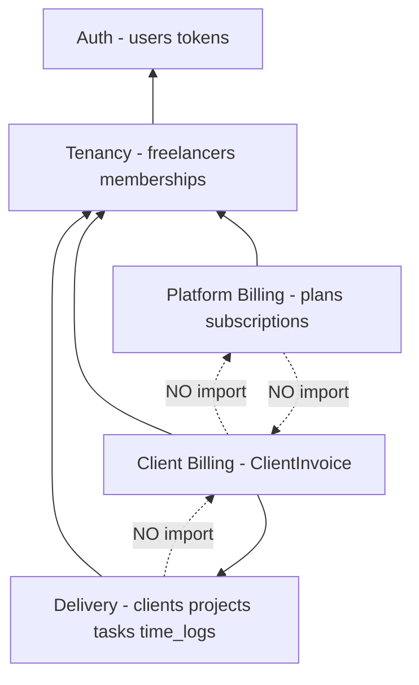

# Architecture Review — Red Flags Audit

Review date: aligned with [architecture-overview.md](./architecture-overview.md) and [database-erd.md](./database-erd.md).

Checks: god tables · missing indexes · circular dependencies · logic in wrong layer.

---

## Summary

| Check | Result | Action |
|-------|--------|--------|
| God tables | **Pass** (one watch item) | Document `client_invoices` rationale |
| Missing indexes | **Fix needed** | Index strategy added to ERD |
| Circular dependencies | **Pass** (one soft FK — managed) | Document layer rules + billing order |
| Business logic layer | **Pass** (with rules) | Application layer guidelines added |

---

## 1. God tables

**Rule of thumb:** A single table with 40+ unrelated columns, or mixing many domains in one row.

| Table | Column count | Verdict |
|-------|--------------|---------|
| `users` | 8 | OK |
| `freelancers` | 7 | OK |
| `clients` | 7 | OK |
| `projects` | 11 | OK |
| `tasks` | 9 | OK |
| `time_logs` | 9 | OK |
| `client_invoices` | **21** | **Watch — not a god table** |
| `client_invoice_items` | 7 | OK |
| `client_invoice_payments` | 8 | OK |
| `plans` | 14 | OK — single domain (pricing tier) |
| `subscriptions` | 14 | OK — single domain (platform billing state) |

### `client_invoices` (21 columns) — acceptable, not a split yet

Columns group into one concern: **an invoice document at a point in time**.

| Group | Columns | Why same table |
|-------|---------|----------------|
| Identity | `invoice_number`, `status`, `currency` | Header |
| Money | `subtotal`, `tax_rate`, `tax_amount`, `total` | Totals snapshot when sent |
| Lifecycle | `issued_at`, `due_date`, `sent_at`, `paid_at` | Workflow |
| Recipient snapshot | `bill_to_name`, `bill_to_email`, `bill_to_address` | Legal/immutable copy after send |
| Scope | `freelancer_id`, `project_id` | Relations |

**Do not split** `bill_to_*` into another table for MVP — invoicing systems commonly snapshot recipient on the document.

**Split later only if** you add PDF storage, multi-currency line mixing, recurring invoice templates, or 15+ new columns.

---

## 2. Missing indexes

Indexes required for tenant filters, webhooks, jobs, and membership lookups. Full list: [database-erd.md § Index strategy](./database-erd.md#8-index-strategy).

### Previously undocumented — now required

| Table | Index | Query / reason |
|-------|-------|----------------|
| `freelancer_memberships` | `(user_id)` | `/me` — list workspaces for logged-in user |
| `freelancer_memberships` | `(freelancer_id, role)` | List admins/owners in workspace |
| `freelancers` | `(owner_user_id)` | Resolve owned workspace |
| `clients` | `(freelancer_id, status)` | List active clients in tenant |
| `projects` | `(freelancer_id, status)` | Dashboard filters |
| `projects` | `(client_id)` | Projects per client (within tenant) |
| `client_invoices` | `(freelancer_id, status)` | Invoice list filters |
| `client_invoices` | `(status, due_date)` | `MarkOverdueClientInvoices` job |
| `client_invoice_items` | `(client_invoice_id)` | Load line items |
| `client_invoice_payments` | `(client_invoice_id)` | Sum payments per invoice |
| `time_logs` | `(client_invoice_item_id)` | Nullable; find billed logs |
| `time_logs` | `(logged_at)` | Date-range lists; future archive job |
| `time_logs` | `(task_id)` WHERE `client_invoice_item_id IS NULL` | Unbilled hours (partial index — PostgreSQL) |
| `subscriptions` | `(provider_subscription_id)` | Stripe webhook lookup |
| `subscription_charges` | `(provider_charge_id)` | Webhook idempotency |
| `subscription_charges` | `(subscription_id, status)` | Billing history |

### Already documented

- `clients.freelancer_id`
- `projects.(freelancer_id, client_id)`
- `tasks.project_id`
- `time_logs.(task_id, user_id)`
- `client_invoices.UK (freelancer_id, invoice_number)`
- `client_invoices.project_id`
- `subscriptions.freelancer_id`
- `users.email` UK

---

## 3. Circular dependencies

### 3.1 Module dependency graph (must stay acyclic)



**Rules:**

| Module | May depend on | Must NOT depend on |
|--------|---------------|-------------------|
| Auth | — | Tenancy, Billing, Delivery |
| Tenancy | Auth | Billing, Delivery |
| Delivery | Tenancy | Client Billing, Platform Billing |
| Client Billing | Tenancy, Delivery | Platform Billing |
| Platform Billing | Tenancy | Client Billing, Delivery |

Controllers call services downward only. **No service-to-service cycles.**

### 3.2 Soft FK cycle: `time_logs` ↔ `client_invoice_items`

```
time_logs.client_invoice_item_id → client_invoice_items.id
client_invoice_items created from time_logs when billing
```

**Not a hard circular dependency** — `client_invoice_item_id` is nullable.

**Required insert order (application layer):**

1. Create `ClientInvoice` (draft)
2. Create `ClientInvoiceItem`(s)
3. Update `TimeLog.client_invoice_item_id` for billed hours

Never create a circular insert in one DB transaction without nullable FK first.

### 3.3 `users` ↔ `freelancers`

- `freelancers.owner_user_id` → `users`
- `freelancer_memberships` links both

This is a standard **ownership + membership** pattern, not a module cycle. `User` model must not eager-load heavy tenant graphs by default.

---

## 4. Business logic in the wrong layer

### Where logic belongs

| Concern | Layer | Not here |
|---------|-------|----------|
| Tenant row filtering | Eloquent global scope (`BelongsToFreelancer`) | Raw SQL in controllers |
| Authorization | Policies + Gates | Controller `if` checks |
| Plan limits (3 clients, 5 projects) | `PlanLimitService` | DB CHECK constraints |
| Subscription read-only | `EnsureWritableSubscription` middleware | Block in every controller |
| Invoice totals | `ClientInvoiceService::recalculateTotals()` | DB triggers / generated columns |
| Invoice number sequence | `ClientInvoiceService` + DB transaction/lock | Ad-hoc MAX()+1 in controller |
| Mark overdue | `MarkOverdueClientInvoices` job | Cron raw SQL only |
| Stripe state sync | `SubscriptionService` + webhooks | Controller parsing webhooks |
| Validate `project.freelancer_id === client.freelancer_id` | Form request / service | Hope global scope fixes it |
| Time log → invoice lines | `ClientInvoiceService` | SQL JOIN in blade/API |

### Anti-patterns to avoid

```php
// BAD — business rule in controller
if (Client::where('freelancer_id', $id)->count() >= 3) { ... }

// GOOD
$this->planLimitService->assertCanCreateClient($freelancer);
```

```php
// BAD — totals maintained only in DB trigger
// GOOD — ClientInvoiceService recalculates on item save/delete
```

```php
// BAD — subscription check duplicated per action
// GOOD — EnsureWritableSubscription middleware on write route group
```

```php
// BAD — global scope used to enforce business rules beyond tenant filter
// GOOD — scope only adds WHERE freelancer_id = ?
```

### Stored computed fields (intentional denormalization)

| Field | Maintained by | Why stored |
|-------|---------------|------------|
| `client_invoices.subtotal/tax/total` | App service on item change | Snapshot when sent; PDF/history |
| `projects.freelancer_id` | App on create from `TenantContext` | Fast tenant queries (validate against `client.freelancer_id`) |
| `client_invoices.bill_to_*` | App on status → `sent` | Immutable recipient snapshot |

**Never** use PostgreSQL triggers for these in MVP — keeps logic testable in PHPUnit.

---

## 5. Denormalization risks (documented guards)

| Denormalized field | Risk | Guard |
|--------------------|------|-------|
| `projects.freelancer_id` | Drift from `clients.freelancer_id` | Validate on create/update in `StoreProjectRequest` |
| `client_invoices.freelancer_id` | Drift from `projects.freelancer_id` | Set from `TenantContext` + assert project in tenant |
| Invoice totals | Drift from line items | Recalculate in service; optional reconciliation test |

---

## 6. Action items for implementation

Track in [implementation-tasks.md](./implementation-tasks.md):

- [ ] **Task 1.28** — Add index migration covering all indexes in ERD §8 (incl. `time_logs.logged_at`)
- [ ] **Task 2.11** — Document module boundaries in `app/Services/` namespaces
- [ ] **Task 2.12** — Cursor pagination + tenant API conventions on all list endpoints
- [ ] **Task 2.13 – 2.14** — Redis cache config + Plan/Subscription/Membership cache services
- [ ] **Task 3.10** — `admin_activity_logs` for super-admin tenant override
- [ ] **Task 15.11** — `PlanLimitService` with transaction + `lockForUpdate`
- [ ] Enforce `ClientInvoiceService` as sole owner of totals + billing link to `time_logs`
- [ ] Add partial index migration for unbilled `time_logs` (PostgreSQL)

Full weakness → mitigation matrix: [design-rationale-and-scaling.md §3](./design-rationale-and-scaling.md#3-known-weaknesses--mitigations).

---

## 7. Sign-off

Architecture is **sound for MVP** after index strategy, layer rules, and scale-smooth guardrails are applied. No god tables, no blocking circular dependencies, no requirement to move core business rules into SQL. Big-scale infra (replicas, partitioning) is **deferred** to Phase 17 — see [design-rationale-and-scaling.md](./design-rationale-and-scaling.md).
