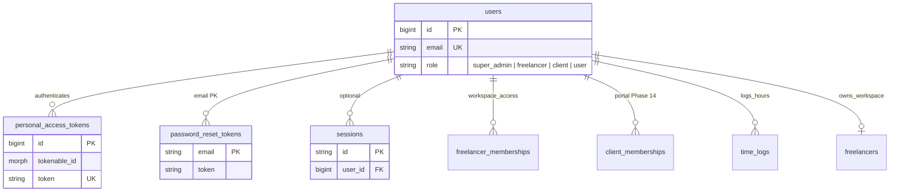
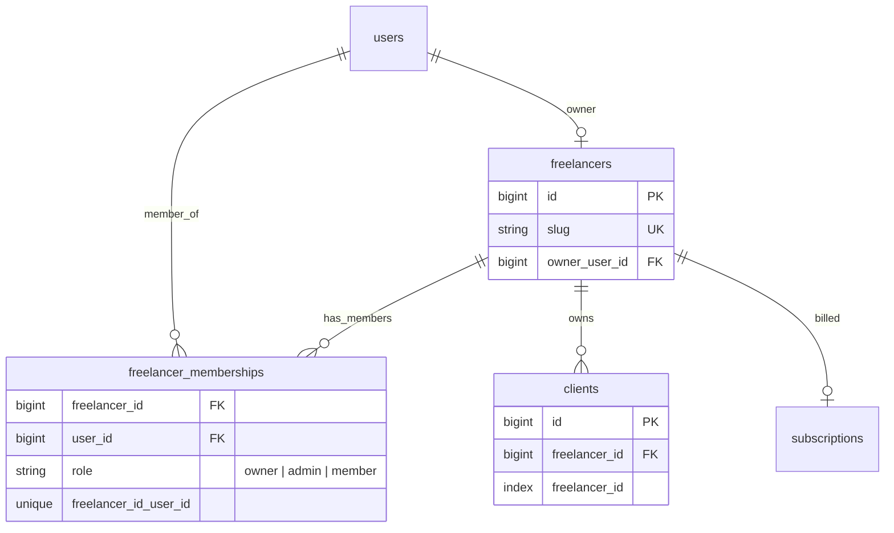
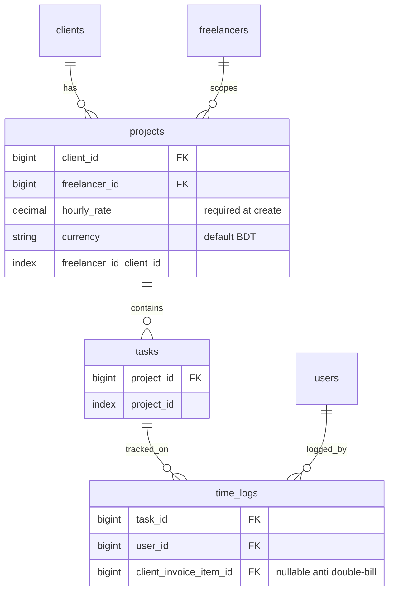
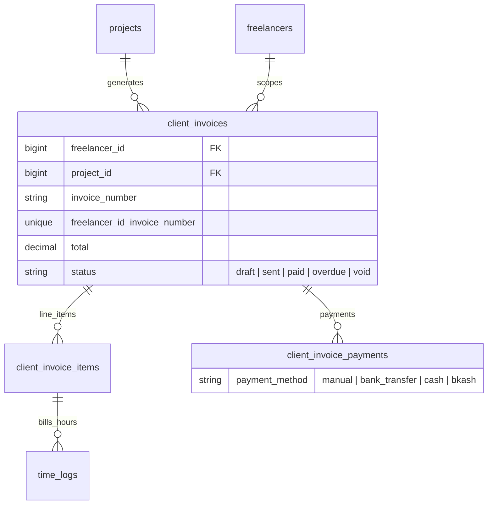
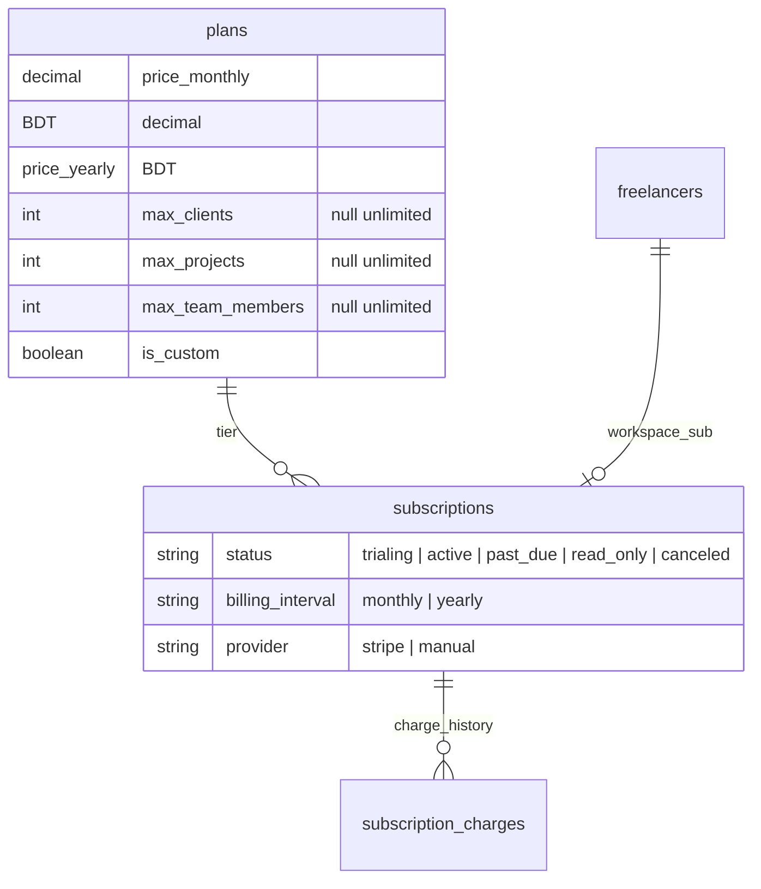

# Database ERD — LanceHive

Entity Relationship Diagram for the full planned schema. Includes **existing** Laravel tables and **planned** domain tables.

Related: [architecture-overview.md](./architecture-overview.md) · [system-architecture-diagram.md](./system-architecture-diagram.md)

---

## Legend

| Symbol | Meaning |
|--------|---------|
| PK | Primary key |
| FK | Foreign key |
| UK | Unique constraint |
| ○── | One |
| ○──○ | Many |
| `(S)` | Soft delete (`deleted_at`) |

**Tenant scoping:** tables with `freelancer_id` are isolated per workspace via global scope.

---

## 1. Master ERD (all tables)

```mermaid
erDiagram
    users ||--o{ personal_access_tokens : "has"
    users ||--o{ freelancer_memberships : "has"
    users ||--o{ client_memberships : "Phase 14"
    users ||--o{ time_logs : "logs"
    users ||--o| freelancers : "owner_user_id"

    freelancers ||--o{ freelancer_memberships : "has"
    freelancers ||--o| subscriptions : "has"
    freelancers ||--o{ clients : "owns"
    freelancers ||--o{ projects : "scopes"
    freelancers ||--o{ client_invoices : "scopes"

    plans ||--o{ subscriptions : "offers"

    subscriptions ||--o{ subscription_charges : "records"

    clients ||--o{ projects : "has"
    clients ||--o{ client_memberships : "Phase 14"

    projects ||--o{ tasks : "has"
    projects ||--o{ client_invoices : "bills"

    tasks ||--o{ time_logs : "tracks"

    client_invoices ||--o{ client_invoice_items : "contains"
    client_invoices ||--o{ client_invoice_payments : "receives"

    client_invoice_items ||--o{ time_logs : "bills"

    users {
        bigint id PK
        string name
        string email UK
        string password
        string role
        timestamp email_verified_at
        timestamps created_at_updated_at
    }

    freelancers {
        bigint id PK
        string name
        string slug UK
        string status
        bigint owner_user_id FK
        timestamps created_at_updated_at
    }

    freelancer_memberships {
        bigint id PK
        bigint freelancer_id FK
        bigint user_id FK
        string role
        timestamps created_at_updated_at
    }

    plans {
        bigint id PK
        string name
        string slug UK
        decimal price_monthly
        decimal price_yearly
        string currency
        int max_clients
        int max_projects
        int max_team_members
        boolean is_custom
        boolean is_active
        int sort_order
        timestamps created_at_updated_at
    }

    subscriptions {
        bigint id PK
        bigint freelancer_id FK
        bigint plan_id FK
        string status
        string billing_interval
        timestamp trial_ends_at
        timestamp current_period_start
        timestamp current_period_end
        timestamp read_only_at
        timestamp canceled_at
        string provider
        string provider_subscription_id
        timestamps created_at_updated_at
    }

    subscription_charges {
        bigint id PK
        bigint subscription_id FK
        decimal amount
        string currency
        string status
        timestamp paid_at
        string provider_charge_id
        timestamps created_at_updated_at
    }

    clients {
        bigint id PK
        bigint freelancer_id FK
        string name
        string status
        string contact_email
        timestamps created_at_updated_at
    }

    projects {
        bigint id PK
        bigint client_id FK
        bigint freelancer_id FK
        string name
        decimal hourly_rate
        string currency
        string status
        date deadline
        timestamp deleted_at
        timestamps created_at_updated_at
    }

    tasks {
        bigint id PK
        bigint project_id FK
        string title
        string status
        date due_date
        decimal estimated_hours
        timestamp deleted_at
        timestamps created_at_updated_at
    }

    time_logs {
        bigint id PK
        bigint task_id FK
        bigint user_id FK
        decimal hours
        text description
        datetime logged_at
        bigint client_invoice_item_id FK
        timestamps created_at_updated_at
    }

    client_invoices {
        bigint id PK
        bigint freelancer_id FK
        bigint project_id FK
        string invoice_number
        string status
        string currency
        decimal subtotal
        decimal tax_rate
        decimal tax_amount
        decimal total
        date issued_at
        date due_date
        datetime sent_at
        datetime paid_at
        text notes
        string bill_to_name
        string bill_to_email
        text bill_to_address
        timestamp deleted_at
        timestamps created_at_updated_at
    }

    client_invoice_items {
        bigint id PK
        bigint client_invoice_id FK
        string description
        decimal quantity
        decimal rate
        decimal amount
        timestamps created_at_updated_at
    }

    client_invoice_payments {
        bigint id PK
        bigint client_invoice_id FK
        decimal amount
        string payment_method
        string reference
        datetime paid_at
        text notes
        timestamps created_at_updated_at
    }

    client_memberships {
        bigint id PK
        bigint client_id FK
        bigint user_id FK
        string role
        timestamps created_at_updated_at
    }

    personal_access_tokens {
        bigint id PK
        bigint tokenable_id FK
        string tokenable_type
        string name
        string token UK
        text abilities
        timestamp last_used_at
        timestamp expires_at
        timestamps created_at_updated_at
    }
```



---

## 2. ERD by domain

### 2.1 Auth and identity (existing + planned)



### 2.2 Tenancy and workspace



### 2.3 Project delivery



### 2.4 Client billing (freelancer → end client)



### 2.5 Platform billing (freelancer → LanceHive)



---

## 3. Relationship reference

| Parent | Child | Cardinality | FK column | Notes |
|--------|-------|-------------|-----------|-------|
| `users` | `freelancers` | 1 : 0..1 | `freelancers.owner_user_id` | Workspace owner |
| `users` | `freelancer_memberships` | 1 : N | `user_id` | Team access |
| `freelancers` | `freelancer_memberships` | 1 : N | `freelancer_id` | Unique with `user_id` |
| `freelancers` | `clients` | 1 : N | `clients.freelancer_id` | Tenant scoped |
| `freelancers` | `projects` | 1 : N | `projects.freelancer_id` | Denormalized scope |
| `freelancers` | `client_invoices` | 1 : N | `client_invoices.freelancer_id` | Invoice numbering |
| `freelancers` | `subscriptions` | 1 : 0..1 | `subscriptions.freelancer_id` | One active sub |
| `clients` | `projects` | 1 : N | `projects.client_id` | Client-wise projects |
| `projects` | `tasks` | 1 : N | `tasks.project_id` | |
| `projects` | `client_invoices` | 1 : N | `client_invoices.project_id` | Per-project billing |
| `tasks` | `time_logs` | 1 : N | `time_logs.task_id` | |
| `users` | `time_logs` | 1 : N | `time_logs.user_id` | Who logged |
| `client_invoices` | `client_invoice_items` | 1 : N | `client_invoice_id` | |
| `client_invoices` | `client_invoice_payments` | 1 : N | `client_invoice_id` | Manual MVP |
| `client_invoice_items` | `time_logs` | 1 : 0..N | `time_logs.client_invoice_item_id` | Billing link |
| `plans` | `subscriptions` | 1 : N | `subscriptions.plan_id` | |
| `subscriptions` | `subscription_charges` | 1 : N | `subscription_id` | Platform charges |
| `users` | `client_memberships` | 1 : N | `user_id` | Phase 14 portal |
| `clients` | `client_memberships` | 1 : N | `client_id` | Phase 14 portal |
| `users` | `personal_access_tokens` | 1 : N | morph `tokenable` | Sanctum |
| `users` | `admin_activity_logs` | 1 : N | `admin_user_id` | Super-admin audit |

---

## 4. Full table catalog

### 4.1 `users` *(exists)*

| Column | Type | Constraints |
|--------|------|-------------|
| id | bigint | PK |
| name | varchar | |
| email | varchar | UK |
| email_verified_at | timestamp | nullable |
| password | varchar | |
| role | varchar | default `user` (`super_admin` for platform operators) |
| timezone | varchar(64) | default `UTC` — Phase 18 |
| locale | varchar(10) | default `en` — Phase 18 |
| notification_preferences | jsonb | default subscription/invite/invoice toggles — Phase 18 |
| remember_token | varchar | nullable |
| created_at, updated_at | timestamp | |

### 4.2 `personal_access_tokens` *(exists — Sanctum)*

| Column | Type | Constraints |
|--------|------|-------------|
| id | bigint | PK |
| tokenable_type | varchar | morph |
| tokenable_id | bigint | FK → users |
| name | varchar | |
| token | varchar(64) | UK |
| abilities | text | nullable |
| last_used_at | timestamp | nullable |
| expires_at | timestamp | nullable |
| created_at, updated_at | timestamp | |

### 4.3 `password_reset_tokens` *(exists)*

| Column | Type | Constraints |
|--------|------|-------------|
| email | varchar | PK |
| token | varchar | |
| created_at | timestamp | nullable |

### 4.4 `sessions` *(exists)*

| Column | Type | Constraints |
|--------|------|-------------|
| id | varchar | PK |
| user_id | bigint | FK → users, nullable, index |
| ip_address | varchar(45) | nullable |
| user_agent | text | nullable |
| payload | longtext | |
| last_activity | int | index |

### 4.5 `freelancers` *(planned)*

| Column | Type | Constraints |
|--------|------|-------------|
| id | bigint | PK |
| name | varchar | |
| slug | varchar | UK |
| status | varchar | `pending`, `active`, `suspended` |
| owner_user_id | bigint | FK → users |
| default_currency | char(3) | default `BDT` — Phase 18 |
| invoice_number_prefix | varchar(20) | default `INV` — Phase 18 |
| default_tax_rate | decimal(5,2) | nullable — Phase 18 |
| invoice_footer_notes | text | nullable — Phase 18 |
| business_name | varchar | nullable — Phase 18 |
| business_email | varchar | nullable — Phase 18 |
| business_address | text | nullable — Phase 18 |
| created_at, updated_at | timestamp | |

### 4.5b `platform_settings` *(Phase 18 — singleton)*

| Column | Type | Constraints |
|--------|------|-------------|
| id | bigint | PK — always `1` |
| default_trial_days | int | default `14` |
| default_plan_slug | varchar | default `starter` |
| support_email | varchar | |
| maintenance_mode | boolean | default `false` |
| created_at, updated_at | timestamp | |

Seeded on migrate. Super-admin editable via `PATCH /admin/settings`. Cached via `PlatformSettingsCache`.

### 4.6 `freelancer_memberships` *(planned)*

| Column | Type | Constraints |
|--------|------|-------------|
| id | bigint | PK |
| freelancer_id | bigint | FK → freelancers |
| user_id | bigint | FK → users |
| role | varchar | `owner`, `admin`, `member` |
| created_at, updated_at | timestamp | |
| | | **UK** (`freelancer_id`, `user_id`) |

### 4.7 `clients` *(planned)*

| Column | Type | Constraints |
|--------|------|-------------|
| id | bigint | PK |
| freelancer_id | bigint | FK → freelancers, index |
| name | varchar | |
| status | varchar | `active`, `archived` |
| contact_email | varchar | nullable |
| created_at, updated_at | timestamp | |

### 4.8 `projects` *(planned)*

| Column | Type | Constraints |
|--------|------|-------------|
| id | bigint | PK |
| client_id | bigint | FK → clients |
| freelancer_id | bigint | FK → freelancers |
| name | varchar | |
| hourly_rate | decimal(12,2) | required |
| currency | char(3) | default `BDT` |
| status | varchar | `active`, `on_hold`, `completed` |
| deadline | date | nullable |
| deleted_at | timestamp | nullable (soft delete) |
| created_at, updated_at | timestamp | |
| | | **index** (`freelancer_id`, `client_id`) |

### 4.9 `tasks` *(planned)*

| Column | Type | Constraints |
|--------|------|-------------|
| id | bigint | PK |
| project_id | bigint | FK → projects, index |
| title | varchar | |
| status | varchar | `todo`, `in_progress`, `done` |
| due_date | date | nullable |
| estimated_hours | decimal(8,2) | nullable |
| deleted_at | timestamp | nullable |
| created_at, updated_at | timestamp | |

### 4.10 `time_logs` *(planned)*

| Column | Type | Constraints |
|--------|------|-------------|
| id | bigint | PK |
| task_id | bigint | FK → tasks |
| user_id | bigint | FK → users |
| hours | decimal(8,2) | |
| description | text | nullable |
| logged_at | datetime | |
| client_invoice_item_id | bigint | FK → client_invoice_items, nullable |
| created_at, updated_at | timestamp | |
| | | **index** (`task_id`, `user_id`) |

### 4.11 `client_invoices` *(planned)*

| Column | Type | Constraints |
|--------|------|-------------|
| id | bigint | PK |
| freelancer_id | bigint | FK → freelancers |
| project_id | bigint | FK → projects |
| invoice_number | varchar | |
| status | varchar | `draft`, `sent`, `paid`, `overdue`, `void` |
| currency | char(3) | default `BDT` |
| subtotal | decimal(12,2) | |
| tax_rate | decimal(5,2) | nullable |
| tax_amount | decimal(12,2) | |
| total | decimal(12,2) | |
| issued_at | date | nullable |
| due_date | date | nullable |
| sent_at | datetime | nullable |
| paid_at | datetime | nullable |
| notes | text | nullable |
| bill_to_name | varchar | |
| bill_to_email | varchar | nullable |
| bill_to_address | text | nullable |
| deleted_at | timestamp | nullable |
| created_at, updated_at | timestamp | |
| | | **UK** (`freelancer_id`, `invoice_number`) |
| | | **index** `project_id` |

### 4.12 `client_invoice_items` *(planned)*

| Column | Type | Constraints |
|--------|------|-------------|
| id | bigint | PK |
| client_invoice_id | bigint | FK → client_invoices |
| description | varchar | |
| quantity | decimal(10,2) | |
| rate | decimal(12,2) | |
| amount | decimal(12,2) | |
| created_at, updated_at | timestamp | |

### 4.13 `client_invoice_payments` *(planned)*

| Column | Type | Constraints |
|--------|------|-------------|
| id | bigint | PK |
| client_invoice_id | bigint | FK → client_invoices |
| amount | decimal(12,2) | |
| payment_method | varchar | `manual`, `bank_transfer`, `cash`, `other`, `bkash` |
| reference | varchar | nullable |
| paid_at | datetime | |
| notes | text | nullable |
| created_at, updated_at | timestamp | |

### 4.14 `plans` *(planned)*

| Column | Type | Constraints |
|--------|------|-------------|
| id | bigint | PK |
| name | varchar | |
| slug | varchar | UK |
| price_monthly | decimal(10,2) | nullable (custom plans) |
| price_yearly | decimal(10,2) | nullable |
| currency | char(3) | default `BDT` |
| max_clients | int | nullable = unlimited |
| max_projects | int | nullable = unlimited |
| max_team_members | int | nullable = unlimited |
| is_custom | boolean | default false |
| is_active | boolean | default true |
| sort_order | int | default 0 |
| stripe_price_monthly_id | varchar | nullable (Phase 15) |
| stripe_price_yearly_id | varchar | nullable (Phase 15) |
| created_at, updated_at | timestamp | |

### 4.15 `subscriptions` *(planned)*

| Column | Type | Constraints |
|--------|------|-------------|
| id | bigint | PK |
| freelancer_id | bigint | FK → freelancers, **UK** (one subscription per workspace) |
| plan_id | bigint | FK → plans |
| status | varchar | `trialing`, `active`, `past_due`, `read_only`, `canceled` |
| billing_interval | varchar | `monthly`, `yearly`, nullable |
| trial_ends_at | datetime | nullable |
| current_period_start | datetime | nullable |
| current_period_end | datetime | nullable |
| read_only_at | datetime | nullable |
| canceled_at | datetime | nullable |
| provider | varchar | `stripe`, `manual` |
| provider_subscription_id | varchar | nullable |
| created_at, updated_at | timestamp | |

### 4.16 `subscription_charges` *(planned)*

| Column | Type | Constraints |
|--------|------|-------------|
| id | bigint | PK |
| subscription_id | bigint | FK → subscriptions |
| amount | decimal(10,2) | |
| currency | char(3) | default `BDT` |
| status | varchar | `pending`, `paid`, `failed` |
| paid_at | datetime | nullable |
| provider_charge_id | varchar | nullable |
| created_at, updated_at | timestamp | |

### 4.17 `admin_activity_logs` *(planned — Task 3.10)*

| Column | Type | Constraints |
|--------|------|-------------|
| id | bigint | PK |
| admin_user_id | bigint | FK → users |
| action | varchar | e.g. `freelancer.override`, `subscription.assign` |
| target_type | varchar | nullable morph-style |
| target_id | bigint | nullable |
| metadata | json | nullable |
| ip_address | varchar(45) | nullable |
| created_at, updated_at | timestamp | |
| | | **index** (`admin_user_id`, `created_at`) |

### 4.18 `client_memberships` *(planned — Phase 14)*

| Column | Type | Constraints |
|--------|------|-------------|
| id | bigint | PK |
| client_id | bigint | FK → clients |
| user_id | bigint | FK → users |
| role | varchar | `primary`, `member`, `viewer` |
| created_at, updated_at | timestamp | |
| | | **UK** (`client_id`, `user_id`) |

---

## 5. Tenant scoping map

| Table | Scoped by | Mechanism |
|-------|-----------|-----------|
| `clients` | `freelancer_id` | Direct FK + global scope |
| `projects` | `freelancer_id` | Direct FK + global scope |
| `client_invoices` | `freelancer_id` | Direct FK + global scope |
| `tasks` | via `projects` | `BelongsToTenantViaProject` |
| `time_logs` | via `tasks → projects` | Query through project chain |
| `client_invoice_items` | via `client_invoices` | Query through invoice |
| `client_invoice_payments` | via `client_invoices` | Query through invoice |
| `freelancer_memberships` | `freelancer_id` | Membership check |
| `subscriptions` | `freelancer_id` | One per workspace |
| `plans` | — | Platform-wide |
| `users` | — | Platform-wide |

---

## 6. Visual table groups

```
┌─────────────────────────────────────────────────────────────────┐
│  PLATFORM (no freelancer_id)                                    │
│  users · personal_access_tokens · password_reset_tokens         │
│  plans · sessions · platform_settings                           │
│  saved_reports (freelancer_id NULL) · report_exports (NULL)     │
└─────────────────────────────────────────────────────────────────┘

┌─────────────────────────────────────────────────────────────────┐
│  TENANT ROOT                                                    │
│  freelancers ── subscriptions ── subscription_charges           │
│       │              └── plans                                  │
│       ├── freelancer_memberships ── users                       │
│       ├── saved_reports · report_exports (Phase 19)             │
│       └── clients ── client_memberships (Phase 14) ── users     │
└─────────────────────────────────────────────────────────────────┘

┌─────────────────────────────────────────────────────────────────┐
│  TENANT DATA (freelancer_id)                                    │
│  clients ── projects ── tasks ── time_logs                        │
│                └── client_invoices ── client_invoice_items      │
│                              └── client_invoice_payments        │
└─────────────────────────────────────────────────────────────────┘
```

---

## 7. Table count summary

| Group | Tables | Status |
|-------|--------|--------|
| Auth / Laravel | 4 | Exists (`users`, `personal_access_tokens`, `password_reset_tokens`, `sessions`) |
| Tenancy | 3 | Planned |
| Delivery | 3 | Planned |
| Client billing | 3 | Planned |
| Platform billing | 3 | Planned |
| Client portal | 1 | Planned (Phase 14) |
| Admin audit | 1 | Planned (Task 3.10) |
| Settings | 1 | Implemented (Phase 18 — `platform_settings`) |
| Reporting | 2 | Planned (Phase 19 — `saved_reports`, `report_exports`) |
| **Total domain** | **16 planned** + **4 existing** | |

---

## 8. Index strategy

Required indexes for filter/search/join paths. See [architecture-review.md](./architecture-review.md) for audit rationale.

| Table | Index | Type | Used by |
|-------|-------|------|---------|
| `users` | `email` | UNIQUE | Login |
| `freelancers` | `slug` | UNIQUE | Workspace URL |
| `freelancers` | `owner_user_id` | INDEX | Owner lookup |
| `freelancer_memberships` | `(freelancer_id, user_id)` | UNIQUE | Membership |
| `freelancer_memberships` | `user_id` | INDEX | `/me` workspace list |
| `freelancer_memberships` | `(freelancer_id, role)` | INDEX | Admin/owner lists |
| `clients` | `(freelancer_id, status)` | INDEX | Tenant client list; active/archived filter |
| `projects` | `(freelancer_id, client_id)` | INDEX | Scoped project list |
| `projects` | `(freelancer_id, status)` | INDEX | Dashboard filters |
| `projects` | `client_id` | INDEX | Client detail page |
| `tasks` | `project_id` | INDEX | Tasks per project |
| `time_logs` | `(task_id, user_id)` | INDEX | Task/user and unbilled task lookups |
| `time_logs` | `user_id` | INDEX | FK cascades; user-scoped log lists |
| `time_logs` | `logged_at` | INDEX | Date-range lists; future archive job |
| `time_logs` | `client_invoice_item_id` | INDEX | Billed log lookup |
| `client_invoices` | `(freelancer_id, invoice_number)` | UNIQUE | Invoice identity |
| `client_invoices` | `project_id` | INDEX | Project invoices |
| `client_invoices` | `(freelancer_id, status)` | INDEX | Invoice filters |
| `client_invoices` | `(status, due_date)` | INDEX | Overdue job |
| `client_invoice_items` | `client_invoice_id` | INDEX | Line items |
| `client_invoice_payments` | `client_invoice_id` | INDEX | Payment sums |
| `plans` | `slug` | UNIQUE | Plan lookup |
| `subscriptions` | `freelancer_id` | UNIQUE | One sub per workspace |
| `subscriptions` | `plan_id` | INDEX | Plan FK joins and cascades |
| `subscriptions` | `provider_subscription_id` | INDEX | Stripe webhooks |
| `subscription_charges` | `(subscription_id, status)` | INDEX | Charge history; paid/failed filters |
| `subscription_charges` | `provider_charge_id` | UNIQUE | Webhook idempotency |
| `client_memberships` | `(client_id, user_id)` | UNIQUE | Portal access |
| `client_memberships` | `user_id` | INDEX | User portal membership lists |
| `saved_reports` | `(freelancer_id, created_by_user_id)` | INDEX | Tenant saved report list |
| `saved_reports` | `created_by_user_id` | INDEX | User's saved reports |
| `report_exports` | `(freelancer_id, requested_by_user_id, status)` | INDEX | Export list and status filter |
| `report_exports` | `expires_at` | INDEX | Purge job |
| `report_exports` | `saved_report_id` | INDEX | Export from saved report |

**Note:** Laravel adds indexes on foreign keys by default in migrations — still declare explicitly in migration files for reviewability.
