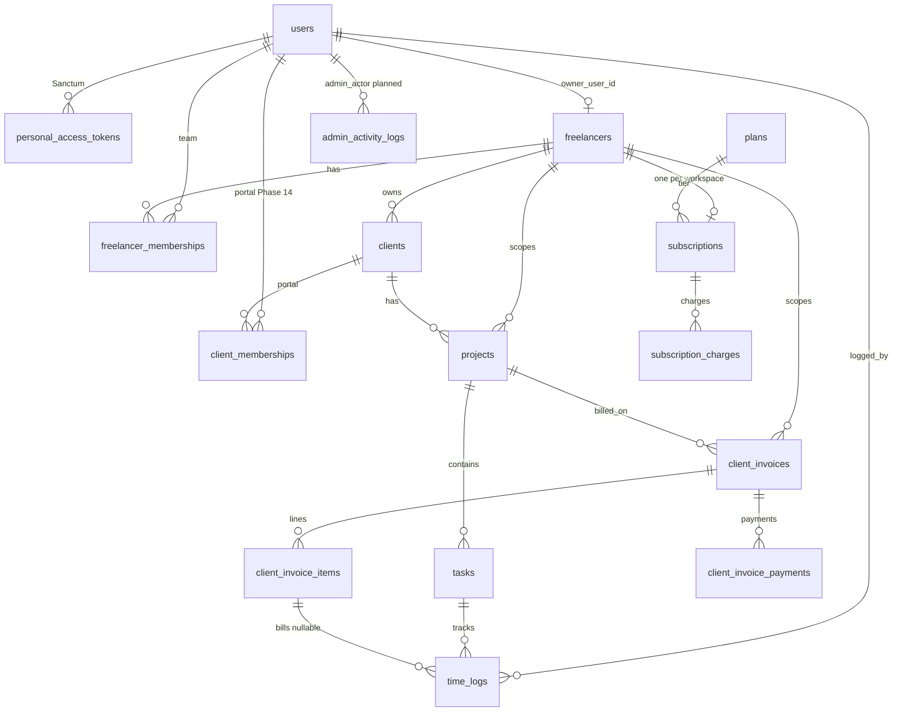

# Final Architecture Audit

**Date:** 2026-09-10  
**Scope:** Implemented Laravel code + planned multi-tenant design (`docs/multi-tenant/*`)  
**Reviewer lens:** Senior architect / DBA — plain-English findings

**Status summary:** Auth API is clean for an early MVP. Multi-tenant domain exists in **documentation only** — not in migrations or code yet. The planned schema is sound; the gap is **implementation and a few schema/doc fixes** before go-live.

---

## 1. ARCHITECTURE

### Layer separation (API → Business Logic → Database)

| Layer | Current code | Planned design | Verdict |
|-------|--------------|----------------|---------|
| API | `routes/api.php` → Controllers | Controllers + Form Requests + Resources | OK for auth; tenant CRUD not built |
| Business logic | Mostly in controllers (`AuthController`) | Services (`ClientInvoiceService`, `PlanLimitService`, etc.) | Planned correctly; not implemented |
| Database | Eloquent models (`User` only) | 13 domain tables + scopes | Planned; not migrated |

**Issue:** Multi-tenant business rules exist only in markdown. No `TenantContext`, policies, or services in `app/` yet.

### Coupling and dependencies

- **Planned module graph** (Auth → Tenancy → Delivery → Client Billing; Platform Billing → Tenancy only) is acyclic — see [architecture-review.md §3](./architecture-review.md#3-circular-dependencies).
- **Soft link** `time_logs.client_invoice_item_id` ↔ `client_invoice_items` is managed by insert order in `ClientInvoiceService` — not a hard cycle.
- **Current code** has no god files; largest controller is `AuthController` (~80 lines).

### AuthN / AuthZ layer

| What | Where | Correct? |
|------|-------|----------|
| Authentication | Sanctum bearer tokens, `auth:sanctum` middleware | Yes |
| Platform admin | `Gate::define('super-admin')` + `can:super-admin` on `GET /api/v1/users` | Yes for this route |
| Tenant authorization | Not implemented | Must be Policies + `EnsureFreelancerContext` before tenant APIs |
| Data-layer enforcement | Not implemented | Requires Eloquent global scopes on tenant models |

### What breaks first at 10× load

1. **`GET /api/v1/users`** — loads every user in one query (`UserController.php` lines 15–17); no pagination.
2. **Login** — deletes all tokens then creates one (`AuthController.php` line 32); DB write spike per login at scale.
3. **After multi-tenant launch:** unscoped or unpaginated **`time_logs`** list endpoints (highest row volume) — mitigated in plan via Task 2.12 cursor pagination.
4. **Single PostgreSQL** — fine at 10× if queries stay tenant-scoped; breaks if platform-wide reports run synchronously in HTTP requests.

---

## 2. DATABASE DESIGN

### One entity per table

**Pass** for planned schema. Each table maps to one concept (`clients` = customer org, not mixed with `users`).

**Watch:** `client_invoices` has 21 columns — all invoice-document fields (identity, money, dates, recipient snapshot). Acceptable; not a god table.

### Relationships modelled correctly

**Pass** with notes:

- **Many-to-many:** `users` ↔ `freelancers` via `freelancer_memberships` (join table with role). **Correct.**
- **Many-to-many (future):** `users` ↔ `clients` via `client_memberships` (Phase 14). **Correct.**
- **One freelancer → one subscription:** Documented as 1:0..1 but **missing UNIQUE on `subscriptions.freelancer_id`** in ERD §4.15 — see issues list.

### Foreign keys

Planned migrations specify FK columns in [database-erd.md §4](./database-erd.md#4-full-table-catalog). Laravel migrations must use `$table->foreignId()->constrained()` — **not yet created** for domain tables.

**Existing migrations:**

- `sessions.user_id` — indexed, nullable FK-style column ✓
- `users.role` — **no FK, no CHECK** — any string can be stored

### Duplicated data (intentional denormalization)

| Column | Table | Why duplicated | Guard |
|--------|-------|------------------|-------|
| `freelancer_id` | `projects` | Fast tenant filtering | Validate matches `clients.freelancer_id` on write |
| `freelancer_id` | `client_invoices` | Invoice numbering per tenant | Set from `TenantContext` |
| `bill_to_*`, totals | `client_invoices` | Immutable snapshot when sent | `ClientInvoiceService` recalculates |
| `hourly_rate` | `projects` | Rate at agreement time | Not copied to every time_log |

**Do not normalize** `bill_to_*` for MVP — standard invoicing pattern.

### Indexes

Full strategy: [database-erd.md §8](./database-erd.md#8-index-strategy). Planned indexes cover tenant filters, webhooks, overdue job, unbilled time logs.

**Gaps:**

- `subscriptions.freelancer_id` — index only; needs **UNIQUE**
- `admin_activity_logs` — in Task 3.10 but **not in ERD table catalog**
- `users.role` — no index (only matters if filtering users by role at scale)

### Plain-English: every table relationship

**Existing tables**

- **`users`** — A person who can log in (super-admin, freelancer team member, or future client portal user).
- **`personal_access_tokens`** — Each login session/API token belongs to one `users` row (Sanctum).
- **`password_reset_tokens`** — Password reset links keyed by email.
- **`sessions`** — Web session storage (Laravel default; API primarily uses Sanctum tokens).

**Planned — tenancy**

- **`freelancers`** — One workspace/tenant. Owned by one `users` row via `owner_user_id`.
- **`freelancer_memberships`** — Join table: many `users` can belong to many `freelancers`, with a role (`owner`, `admin`, `member`) on each link.

**Planned — delivery**

- **`clients`** — A customer organization belonging to one `freelancer`. Not a login account by itself.
- **`projects`** — Work for one `clients` row, scoped to one `freelancer` (duplicate `freelancer_id` for fast queries).
- **`tasks`** — Work items inside one `projects` row.
- **`time_logs`** — Hours one `users` row logged against one `tasks` row; optionally linked to one `client_invoice_items` row when billed.

**Planned — client billing**

- **`client_invoices`** — A bill from a freelancer for one `projects` row (scoped to `freelancer`).
- **`client_invoice_items`** — Line items on one invoice.
- **`client_invoice_payments`** — Payment records against one invoice (manual MVP).

**Planned — platform billing**

- **`plans`** — Pricing tier (limits, BDT prices).
- **`subscriptions`** — One freelancer's subscription to one `plans` row.
- **`subscription_charges`** — Individual charge records for one subscription.

**Planned — client portal (Phase 14)**

- **`client_memberships`** — Join table: which `users` can access which `clients` org (portal login).

**Planned — admin audit**

- **`admin_activity_logs`** — Records super-admin actions (override tenant, assign plan).

---

## 3. SECURITY

| Check | Status | Detail |
|-------|--------|--------|
| SQL injection | **Low risk** | Eloquent parameter binding; no raw user SQL in `app/` |
| Password storage | **Pass** | `User` casts `password` → `hashed` (`app/Models/User.php` line 31) |
| Secrets in code | **Pass** | DB/mail keys in `.env.example`; none hardcoded in `app/` |
| Access control at data layer | **Fail (tenant)** | No global scopes yet — tenant isolation is documentation only |
| Admin routes | **Pass** | `GET /api/v1/users` requires `can:super-admin` (`routes/features/v1/auth.php`) |
| Debug / docs exposure | **Pass if configured** | `viewApiDocs` gate limits `/docs/api` to `local` + `testing` (`AppServiceProvider.php` line 56) |
| Rate limiting | **Pass** | Login 5/min, password reset 3/min (`AppServiceProvider.php` lines 38–39) |

### Security issues

- **`users.role` in `$fillable`** (`User.php` line 15) — if a profile/update endpoint is added without blocking `role`, a user could escalate to `super_admin`. Remove from fillable; set role only in admin/seed code.
- **No email verification gate on login** — unverified users can authenticate (`AuthController::login`).
- **Seeded default password** — `UserFactory` uses `'password'` (line 32) — dev only; document for production seed strategy.

---

## 4. SCALABILITY

| Check | Current code | Planned |
|-------|--------------|---------|
| N+1 queries | Minimal (few relations loaded) | Risk on nested lists (tasks + logs) — use eager loading in Resources |
| Pagination | **Missing** on `GET /users` | Cursor pagination Task 2.12 on all lists |
| Background jobs | Queue configured (`QUEUE_CONNECTION=database`) | `MarkOverdueClientInvoices` planned; password email sync today |
| Caching | `.env.example` had `database` driver | **Plan:** Redis for plans/subscription/memberships — see architecture-overview § Caching (Tasks 2.13–2.14) |

**10× load:** `UserController::index()` full table scan + full JSON payload is the first concrete bottleneck in **current** code.

**Future 10× (post multi-tenant):** unpaginated `time_logs` without tenant filter.

---

## 5. CODE QUALITY

| Check | Status |
|-------|--------|
| Logic in controllers | Auth logic in controller is acceptable for 5 endpoints; tenant logic must move to services (documented) |
| Error handling | API returns JSON errors; `shouldRenderJsonWhen` for `api/*` (`bootstrap/app.php` line 19) |
| Duplication | None significant yet |
| Env-specific config | **Pass** — `config/app.php` uses `env()`; `.env.production` has `APP_DEBUG=false` |

### Code / design quality issues

- **Role model split-brain:** Code uses `UserRole::Freelancer` / `::Client` on `users.role`; architecture plan moves to `users.role = user` + pivot roles ([architecture-overview.md](./architecture-overview.md) line 458). Phase 12 is late — migrate before tenant APIs.
- **`.env.example` uses SQLite** (line 24) but **`compose.yaml` uses PostgreSQL** — local dev confusion; partial indexes in plan are PostgreSQL-specific.
- **`DocumentationTest`** asserts docs are public in test env — correct; ensure CI never sets `APP_ENV=local` on production.

---

## Severity-ranked issues (all)

| # | Sev | Issue | Location |
|---|-----|-------|----------|
| 1 | 🔴 | **Tenant isolation not implemented** — no `freelancer_id` scopes, middleware, or isolation tests in code | `app/` — planned Phase 2, 11 |
| 2 | 🔴 | **`role` mass-assignable** — privilege escalation if user update endpoint added | `app/Models/User.php:15` |
| 3 | 🟠 | **Role model conflicts with planned architecture** — global `freelancer`/`client` roles vs `clients` table + memberships | `app/Enums/UserRole.php`, docs overview L458 |
| 4 | 🟠 | **`GET /api/v1/users` loads all rows** — no pagination | `app/Features/Auth/Http/Controllers/UserController.php` |
| 5 | 🟠 | **Missing UNIQUE on `subscriptions.freelancer_id`** — duplicate subscriptions possible | `docs/multi-tenant/database-erd.md` §4.15 |
| 6 | 🟠 | **No Policies / model scopes for tenant data** — authorization only at route level today | `routes/api.php` |
| 7 | 🟡 | **`users.role` unvalidated at DB** — varchar, no CHECK constraint | `database/migrations/2026_09_09_073339_add_role_to_users_table.php:16` |
| 8 | 🟡 | **`APP_DEBUG=true` in `.env.example`** — production misconfiguration risk | `.env.example:4` |
| 9 | 🟡 | **SQLite default vs PostgreSQL in Sail** — partial indexes won't match local tests | `.env.example:24`, `compose.yaml:28-29` |
| 10 | 🟡 | **`admin_activity_logs` missing from ERD** | `implementation-tasks.md` Task 3.10 |
| 11 | 🟡 | **Cache not implemented** — use Redis (Tasks 2.13–2.14), not Postgres `cache` table | `.env.example`, architecture-overview § Caching |
| 12 | 🟡 | **Denormalized `projects.freelancer_id` drift risk** | Guard in form requests — not coded yet |
| 13 | 🟡 | **No email verification required before login** | `app/Http/Controllers/Api/AuthController.php:22-39` |
| 14 | 🟢 | Login revokes all tokens (aggressive session hygiene) | `AuthController.php:32` |
| 15 | 🟢 | User API returns raw Eloquent models (no Resource transformer) | `UserController.php:19-21` |
| 16 | 🟢 | Factory default password `'password'` | `database/factories/UserFactory.php:32` |

---

## Fix this first (top 3 before go-live)

### Multi-tenant product go-live

1. **Implement Phase 2 tenant isolation** — `TenantContext`, `BelongsToFreelancer`, `EnsureFreelancerContext`, Policies, and Phase 11 cross-tenant tests. Without this, one bug exposes every freelancer's data.
2. **Resolve the role model before tenant CRUD** — add `UserRole::User`, move workspace/client permissions to pivot tables; stop using global `freelancer`/`client` on `users.role`. Do not build `/clients` APIs on the current role enum.
3. **Add `UNIQUE (freelancer_id)` on `subscriptions` + cursor pagination on every list route** — including refactor `UserController` to paginate.

### Auth-only API deploy (current code)

1. Set **`APP_DEBUG=false`** and verify `/docs/api` is blocked in production (`viewApiDocs` gate).
2. **Remove `role` from `User::$fillable`** — set role only via admin paths.
3. **Paginate `GET /api/v1/users`** — even for super-admin.

---

## ERD (existing + planned)

**Existing tables only:** `users`, `personal_access_tokens`, `password_reset_tokens`, `sessions`, `cache`, `jobs`.

---

## One thing this design does well

**Clear separation of the two billing worlds** — `ClientInvoice*` (freelancer bills their client) vs `Subscription*` / `Plan` (freelancer pays LanceHive). That naming and module boundary prevents the most common SaaS billing bugs (wrong webhook handler, wrong policy, mixed invoice numbers) and stays understandable as the product grows.

---

## Recommended doc/code follow-ups

| Item | Action |
|------|--------|
| ERD §4.15 | Add **UK** on `subscriptions.freelancer_id` |
| ERD catalog | Add `admin_activity_logs` table |
| Task 1.25 / 1.28 | Enforce unique subscription per freelancer in migration |
| Task 12.x | Move earlier — before Phase 4 client APIs |
| `.env.example` | Default to `pgsql` when using Sail; note SQLite skips partial indexes |

See [implementation-tasks.md](./implementation-tasks.md) for build order.
