# LanceHive System Architecture Diagrams

Visual reference for the multi-tenant freelancer platform. Complements [architecture-overview.md](./architecture-overview.md). Design rationale and scale path: [design-rationale-and-scaling.md](./design-rationale-and-scaling.md).

---

## 0. How components talk to each other

Overview of every major interaction path — who calls whom, and in what order.

### 0.1 Component map (all connections)

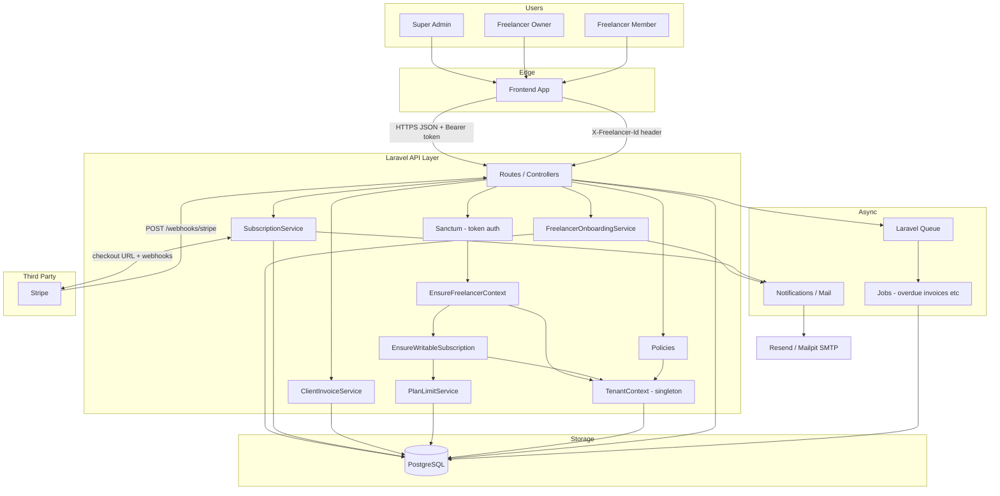

### 0.2 Authenticated read request (e.g. list projects)

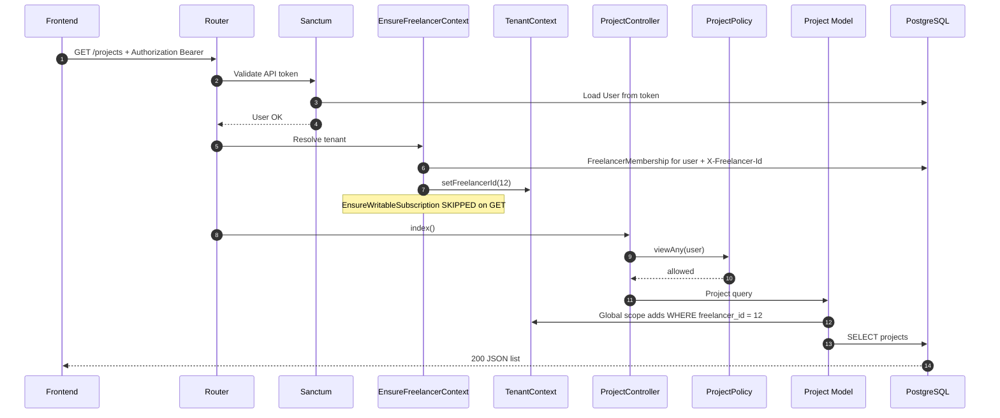

### 0.3 Authenticated write request (e.g. create project)

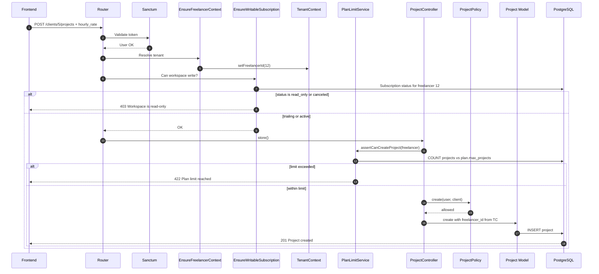

### 0.4 Super-admin onboard freelancer

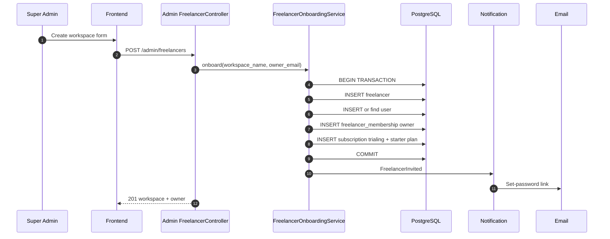

### 0.5 Platform subscription checkout (freelancer pays you)

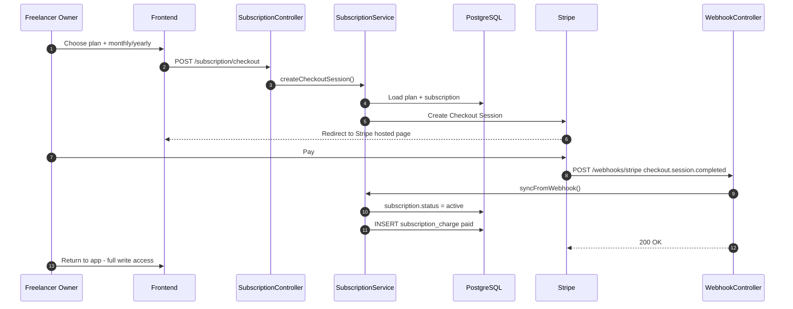

### 0.6 Client invoice and manual payment (MVP)

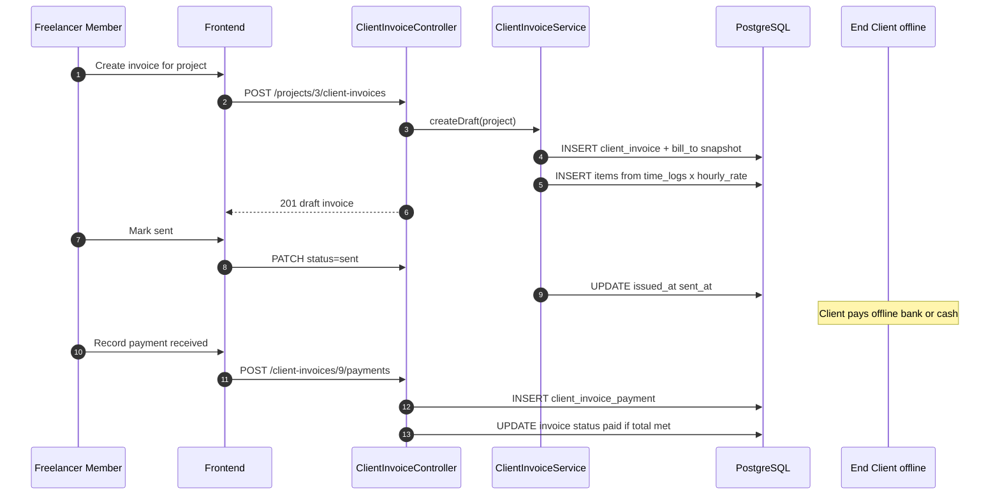

### 0.7 Communication rules (quick reference)

| From | To | Protocol | When |
|------|-----|----------|------|
| Frontend | Laravel API | HTTPS + JSON | Every user action |
| Frontend | Laravel API | `Authorization: Bearer {token}` | After login |
| Frontend | Laravel API | `X-Freelancer-Id: {id}` | User has multiple workspaces |
| Sanctum | PostgreSQL | SQL | Validate token → load User |
| EnsureFreelancerContext | TenantContext | In-memory | Every tenant route |
| EnsureFreelancerContext | PostgreSQL | SQL | Verify membership |
| EnsureWritableSubscription | PostgreSQL | SQL | Every tenant **write** route |
| PlanLimitService | PostgreSQL | SQL | Before create client/project/member |
| Policies | TenantContext | In-memory | Every authorized action |
| Models | TenantContext | Global scope | Auto-filter by freelancer_id |
| SubscriptionService | Stripe | HTTPS REST | Checkout, swap, cancel |
| Stripe | WebhookController | HTTPS POST | Payment events |
| OnboardingService | Mail | Resend (prod) / Mailpit (local) | Invite emails |
| Scheduler | Queue | Internal | Daily overdue invoice job |
| Queue Worker | PostgreSQL | SQL | Async job execution |

---

## 1. High-level system architecture

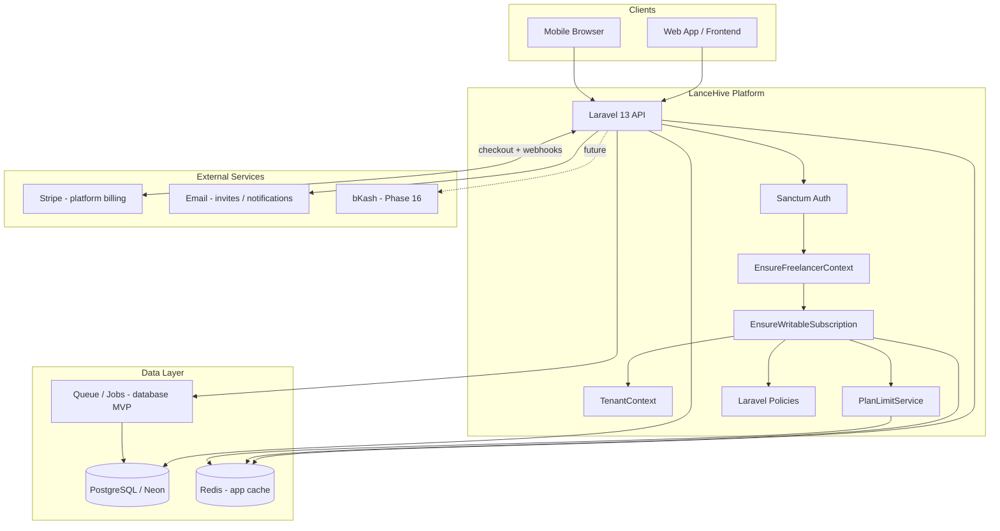

---

## 2. Actor and API surface map

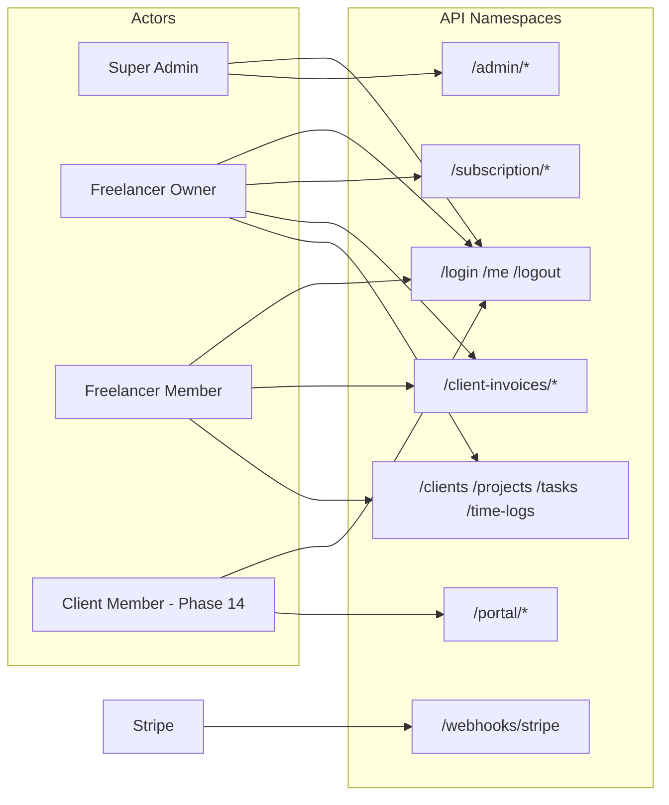

---

## 3. Multi-tenant domain hierarchy

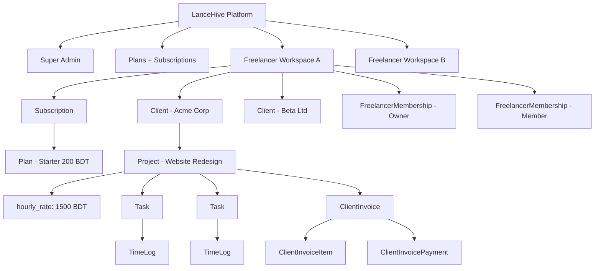

---

## 4. Two billing layers (separate money flows)

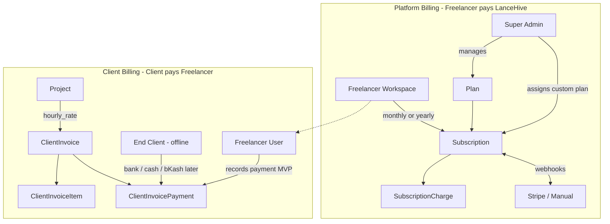

---

## 5. Request flow (tenant-scoped write)

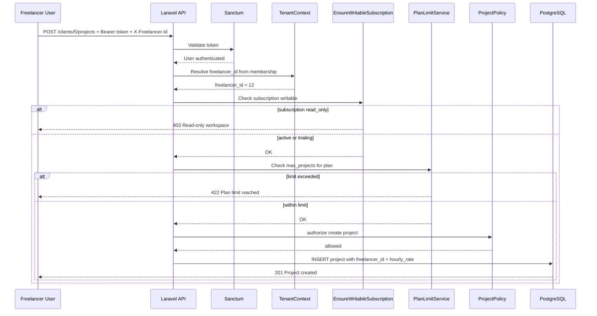

---

## 6. Onboarding and subscription lifecycle

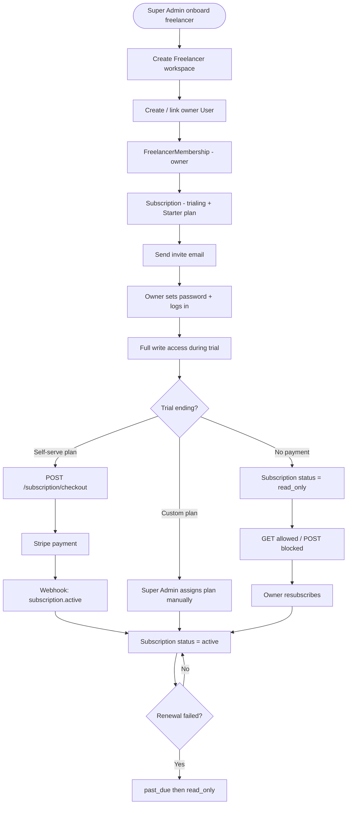

---

## 7. Entity relationship (data model)

> **Full ERD with all columns, indexes, and table catalog:** [database-erd.md](./database-erd.md)

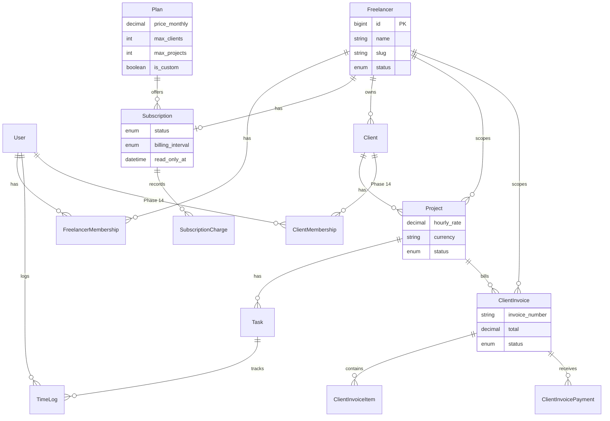

---

## 8. Tenant isolation model

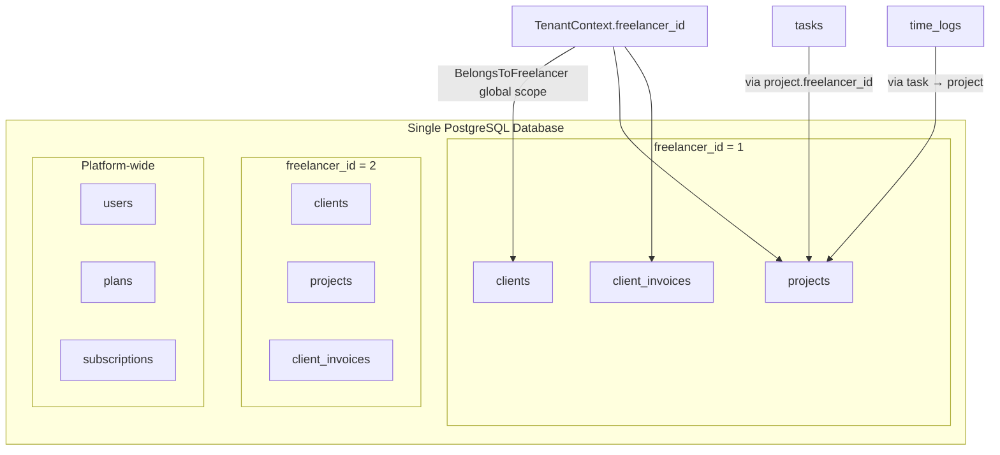

---

## 9. Technology stack (current + planned)

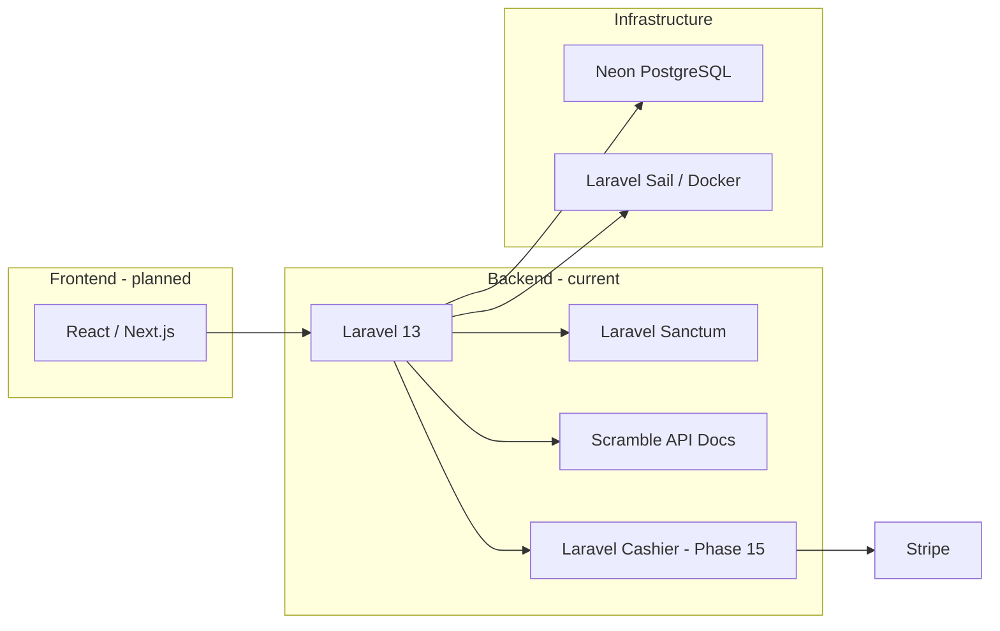

---

## Diagram index

| # | Diagram | Use when |
|---|---------|----------|
| 0 | **Component communication** | How parts talk — request paths, webhooks, async |
| 1 | High-level system | Explaining overall stack to stakeholders |
| 2 | Actor / API map | Routing and permission design |
| 3 | Domain hierarchy | Understanding tenant data tree |
| 4 | Two billing layers | Separating platform vs client money |
| 5 | Request flow | Implementing middleware and policies |
| 6 | Onboarding lifecycle | Subscription and trial behaviour |
| 7 | Entity relationship | Database design and migrations |
| 8 | Tenant isolation | Multi-tenancy scoping strategy |
| 9 | Technology stack | Dev setup and dependencies |
