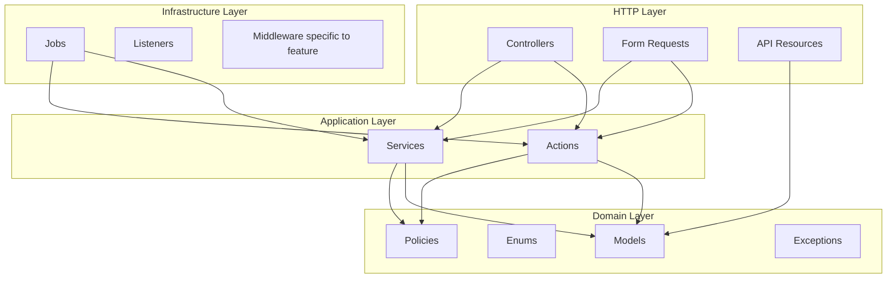
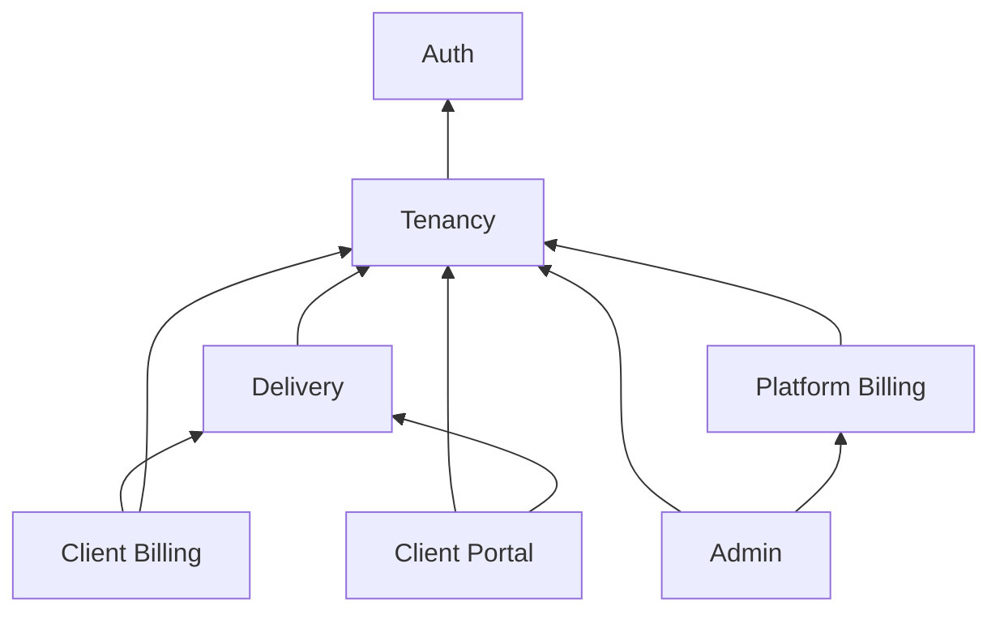

# Feature-Based Architecture — File & Folder Structure

This document defines the **target** LanceHive project layout: feature modules, standard layers, and isolation rules. It complements the domain design in [multi-tenant/architecture-overview.md](../multi-tenant/architecture-overview.md).

---

## 1. Goals

| Goal | How structure supports it |
|------|---------------------------|
| Change one feature without breaking others | Features are folders + namespaces with explicit dependency rules |
| Keep business logic testable | Rules live in Application layer (Actions/Services), not controllers or routes |
| Enforce tenant isolation | Tenancy lives in `Core` + feature scopes; no raw `DB::table` in HTTP |
| Onboard new developers quickly | Same layer names inside every feature |
| Scale the codebase | New features = new folder under `app/Features/` |

---

## 2. Repository layout (top level)

```
lancehive/
├── app/
│   ├── Core/                    # Cross-feature infrastructure (no business rules)
│   └── Features/                # Business features (vertical slices)
├── bootstrap/
├── config/
├── database/
│   ├── factories/               # Grouped by feature namespace (see §7)
│   ├── migrations/              # Timestamped; one concern per migration
│   └── seeders/
├── docs/
│   ├── multi-tenant/            # Domain & tenancy design
│   └── project-structure/       # This guide
├── routes/
│   ├── api.php                  # Version loader → routes/features/{version}/
│   └── features/
│       └── v1/                  # One PHP file per feature module (v2/ when needed)
├── tests/
│   ├── Feature/                 # HTTP/integration — mirrors Features/
│   └── Unit/                    # Pure logic — mirrors Features/ + Core/
├── .env.example
├── compose.yaml
└── phpunit.xml
```

**Not in `app/`:** environment secrets, generated cache, vendor code. Laravel defaults (`storage/`, `public/`, `resources/`) stay as framework expects.

---

## 3. Layer model (standard across every feature)

Every feature module uses the **same four layers**. Dependencies flow **downward only**.



### Layer responsibilities

| Layer | Contains | May call | Must NOT contain |
|-------|----------|----------|------------------|
| **HTTP** | Controllers, Form Requests, API Resources | Application, Domain (models for type hints only) | Business rules, direct `DB::`, plan limits, invoice math |
| **Application** | Actions (single use case), Services (orchestration) | Domain, Core | HTTP types (`Request`, `Response`), route names |
| **Domain** | Eloquent models, Enums, Policies, domain exceptions | Other domain models in **same or lower** modules only | Services from sibling billing modules |
| **Infrastructure** | Jobs, event listeners, feature-specific middleware | Application, Domain | Controller logic |

### Naming conventions

| Artifact | Pattern | Example |
|----------|---------|---------|
| Controller | `{Entity}Controller` | `ClientInvoiceController` |
| Form request | `{Verb}{Entity}Request` | `StoreProjectRequest` |
| API resource | `{Entity}Resource` | `ClientInvoiceResource` |
| Action (one operation) | `{Verb}{Entity}Action` | `CreateClientAction` |
| Service (multi-step) | `{Entity}Service` | `ClientInvoiceService` |
| Policy | `{Entity}Policy` | `ProjectPolicy` |
| Job | `{Verb}{Entity}Job` | `MarkOverdueClientInvoicesJob` |
| Enum | `{Entity}{Attribute}` | `ProjectStatus`, `ClientInvoiceStatus` |
| Model | Singular PascalCase | `ClientInvoice`, `TimeLog` |
| Test (feature) | `{Entity}Test` or `{Endpoint}Test` | `StoreProjectTest` |

All PHP files: `declare(strict_types=1);` · classes `final` where extension is not intended · PSR-4 namespaces match folder path.

---

## 4. `app/Core/` — shared infrastructure

Code used by **two or more features** but that is **not a business feature** itself.

```
app/Core/
├── Http/
│   ├── Middleware/
│   │   ├── EnsureFreelancerContext.php      # Resolves tenant from membership
│   │   └── EnsureWritableSubscription.php   # Blocks writes when read-only
│   └── Concerns/
│       └── RespondsWithCursorPagination.php
├── Tenancy/
│   ├── TenantContext.php                    # Holds active freelancer_id for request
│   ├── BelongsToFreelancer.php              # Eloquent global scope trait
│   └── Scopes/
│       └── FreelancerScope.php
├── Cache/
│   ├── PlanCache.php
│   ├── SubscriptionCache.php
│   └── MembershipCache.php
├── Pagination/
│   └── CursorPaginator.php                  # Shared meta shape for list APIs
└── Support/
    └── AdminActivityLogger.php              # Super-admin override audit
```

**Rules for `Core`:**

- No imports from `App\Features\*` (features depend on Core, never the reverse).
- Core may use Laravel facades and framework types.
- Tenant **filtering** belongs here (`BelongsToFreelancer`); tenant **authorization** belongs in Policies.

---

## 5. `app/Features/` — business modules

Each feature is a **vertical slice**: all layers for that business area live under one namespace.

### 5.1 Standard feature folder template

```
app/Features/{FeatureName}/
├── Actions/                     # Single-purpose use cases (preferred for CRUD)
├── Services/                    # Multi-step workflows (billing, webhooks)
├── Http/
│   ├── Controllers/
│   ├── Requests/
│   └── Resources/
├── Models/                      # Eloquent models owned by this feature
├── Enums/
├── Policies/
├── Jobs/
├── Events/                      # Optional — domain events
├── Listeners/                   # Optional
└── Exceptions/                  # Feature-specific exceptions
```

Not every feature needs every subfolder — create folders when the first file appears.

### 5.2 Feature catalog

| Feature | Namespace | Owns (models) | API prefix |
|---------|-----------|---------------|------------|
| **Auth** | `App\Features\Auth` | Uses `User` (shared) | `/login`, `/logout`, `/me` |
| **Tenancy** | `App\Features\Tenancy` | `Freelancer`, `FreelancerMembership` | `/freelancers`, `/members` |
| **Delivery** | `App\Features\Delivery` | `Client`, `Project`, `Task`, `TimeLog` | `/clients`, `/projects`, `/tasks`, `/time-logs` |
| **ClientBilling** | `App\Features\ClientBilling` | `ClientInvoice`, `ClientInvoiceItem`, `ClientInvoicePayment` | `/client-invoices` |
| **PlatformBilling** | `App\Features\PlatformBilling` | `Plan`, `Subscription`, `SubscriptionCharge` | `/subscription`, `/webhooks/stripe` |
| **Admin** | `App\Features\Admin` | — (uses other features via services) | `/admin/*` |
| **ClientPortal** | `App\Features\ClientPortal` | `ClientMembership` (Phase 14) | `/portal/*` |

### 5.3 Example: Delivery feature

```
app/Features/Delivery/
├── Actions/
│   ├── CreateClientAction.php
│   ├── CreateProjectAction.php
│   ├── CreateTaskAction.php
│   └── LogTimeAction.php
├── Services/
│   └── ProjectValidationService.php       # e.g. client.freelancer_id === project.freelancer_id
├── Http/
│   ├── Controllers/
│   │   ├── ClientController.php
│   │   ├── ProjectController.php
│   │   ├── TaskController.php
│   │   └── TimeLogController.php
│   ├── Requests/
│   │   ├── StoreClientRequest.php
│   │   ├── StoreProjectRequest.php
│   │   └── StoreTimeLogRequest.php
│   └── Resources/
│       ├── ClientResource.php
│       ├── ProjectResource.php
│       └── TimeLogResource.php
├── Models/
│   ├── Client.php
│   ├── Project.php
│   ├── Task.php
│   └── TimeLog.php
├── Enums/
│   ├── ClientStatus.php
│   ├── ProjectStatus.php
│   └── TaskStatus.php
├── Policies/
│   ├── ClientPolicy.php
│   ├── ProjectPolicy.php
│   └── TaskPolicy.php
└── Jobs/
    └── ArchiveCompletedProjectsJob.php    # Future — example only
```

**Controller pattern (thin):**

```php
final class ProjectController extends Controller
{
    public function store(StoreProjectRequest $request, CreateProjectAction $action): ProjectResource
    {
        $project = $action->execute($request->validated());

        return new ProjectResource($project);
    }
}
```

**Action pattern (single use case):**

```php
final class CreateProjectAction
{
    public function __construct(
        private readonly PlanLimitService $planLimits,
        private readonly TenantContext $tenant,
    ) {}

    public function execute(array $data): Project
    {
        $this->planLimits->assertCanCreateProject($this->tenant->freelancerId());

        // validate client belongs to tenant, create project, dispatch events...
    }
}
```

### 5.4 Example: ClientBilling feature

Billing logic **must** stay in this module ([architecture-review](../multi-tenant/architecture-review.md)):

```
app/Features/ClientBilling/
├── Services/
│   └── ClientInvoiceService.php     # Totals, numbering, time-log → line items
├── Actions/
│   ├── SendClientInvoiceAction.php
│   └── RecordClientPaymentAction.php
├── Http/
│   ├── Controllers/
│   │   └── ClientInvoiceController.php
│   └── ...
├── Models/
│   ├── ClientInvoice.php
│   ├── ClientInvoiceItem.php
│   └── ClientInvoicePayment.php
├── Enums/
│   ├── ClientInvoiceStatus.php
│   └── ClientPaymentMethod.php
├── Policies/
│   └── ClientInvoicePolicy.php
└── Jobs/
    └── MarkOverdueClientInvoicesJob.php
```

### 5.5 Shared model: `User`

`User` is cross-cutting (Auth + memberships). Keep it in a neutral location:

```
app/Features/Auth/Models/User.php
```

Auth feature owns authentication; Tenancy links users to workspaces via `FreelancerMembership`. Other features reference `User` by ID only — avoid loading full tenant graphs from `User` by default.

---

## 6. Module dependency rules (isolation)

These rules are **mandatory**. They match [architecture-review §3](../multi-tenant/architecture-review.md#3-circular-dependencies).



| Feature | May import from | Must NOT import from |
|---------|-----------------|----------------------|
| Auth | Core | Any other Feature |
| Tenancy | Auth, Core | Delivery, Billing |
| Delivery | Tenancy, Core | ClientBilling, PlatformBilling |
| ClientBilling | Delivery, Tenancy, Core | PlatformBilling |
| PlatformBilling | Tenancy, Core | ClientBilling, Delivery |
| Admin | All features **via HTTP-facing services only** | — |
| ClientPortal | Tenancy, Delivery (read), Core | ClientBilling writes, PlatformBilling |

**Enforcement tips:**

- Prefer **constructor injection** of services from allowed modules only.
- Do not call another feature's **Models** directly from a foreign Service — expose an Action or query method in the owning feature.
- Run static analysis (optional): `phpstan` with custom rules or a simple script grepping forbidden `use App\Features\X` imports.

---

## 7. Database folder structure

Migrations stay flat in `database/migrations/` (Laravel convention). Group **factories** and **seeders** by feature for clarity:

```
database/
├── factories/
│   ├── Auth/
│   │   └── UserFactory.php
│   ├── Tenancy/
│   │   ├── FreelancerFactory.php
│   │   └── FreelancerMembershipFactory.php
│   ├── Delivery/
│   │   ├── ClientFactory.php
│   │   └── ProjectFactory.php
│   └── ClientBilling/
│       └── ClientInvoiceFactory.php
├── migrations/
│   └── 2026_09_10_000001_create_freelancers_table.php
└── seeders/
    ├── DatabaseSeeder.php
    ├── PlanSeeder.php
    └── DemoFreelancerSeeder.php
```

**Migration rules:**

- One table (or one tightly related change) per migration file.
- Always add foreign keys and indexes documented in [database-erd.md](../multi-tenant/database-erd.md).
- Tenant-owned tables include `freelancer_id` where specified in architecture overview.

---

## 8. Routes organization

Split routes by **API version**, then by **feature**. Only route files are versioned in the filesystem — domain code stays version-agnostic (see §8.1).

```php
// routes/api.php — Laravel adds /api; config adds /v1
Route::prefix(config('api.route_version'))->group(function (): void {
    $routes = config('api.features_routes'); // routes/features/v1

    require $routes.'/auth.php';

    Route::middleware(['auth:sanctum'])->group(function () use ($routes) {
        require $routes.'/tenancy.php';
        require $routes.'/delivery.php';
        require $routes.'/client-billing.php';
        require $routes.'/platform-billing.php';
    });

    Route::prefix('admin')
        ->middleware(['auth:sanctum', 'can:super-admin'])
        ->group(fn () => require $routes.'/admin.php');

    Route::prefix('webhooks')
        ->group(fn () => require $routes.'/webhooks.php');
});
```

Version config: `config/api.php` · env `API_ROUTE_VERSION=v1`.

### 8.1 Versioning vs folder structure

**Principle:** version the **HTTP contract** (URLs, request/response shapes), not the **domain model**.

| Layer | Version in path? | Location | Notes |
|-------|------------------|----------|-------|
| Route files | **Yes** | `routes/features/v1/{feature}.php` | One folder per API version |
| Controllers, Requests, Resources | **No** (MVP) | `app/Features/{Feature}/Http/...` | Shared until v2 breaks a contract |
| Actions, Services, Models, Enums | **No** | `app/Features/{Feature}/...` | Business rules are not duplicated per version |
| Migrations, factories, seeders | **No** | `database/...` | Single schema; data model is not versioned |
| Feature tests | **No** (MVP) | `tests/Feature/{Feature}/` | Use `$this->apiUrl()` — prefix comes from config |
| Unit tests | **No** | `tests/Unit/{Feature}/` | No HTTP version involved |
| OpenAPI / Scramble | URL version | `config/scramble.php` `api_path` | Documents active version only |

```
routes/features/
├── v1/                           # Current — maps to /api/v1/*
│   ├── auth.php
│   ├── tenancy.php
│   ├── delivery.php
│   ├── client-billing.php
│   ├── platform-billing.php
│   ├── admin.php
│   ├── webhooks.php
│   └── portal.php                # Phase 14
└── v2/                           # Future — parallel folder, new prefix in routes/api.php
    └── …                         # Only add files that differ from v1
```

**When v2 is needed:**

1. Copy `routes/features/v1/` → `v2/` for routes that change.
2. Point changed routes at new controller classes only if response/request shape differs.
3. Optional: `app/Features/Delivery/Http/Controllers/V2/ClientController.php` — use **only** when v1 and v2 must coexist with different HTTP behavior.
4. Keep v1 route files and controllers frozen — no breaking edits.
5. Register both prefixes in `routes/api.php`:

```php
Route::prefix('v1')->group(fn () => /* load routes/features/v1 */);
Route::prefix('v2')->group(fn () => /* load routes/features/v2 */);
```

**Do not** add `V1/` inside `app/Features/` while only one API version exists — it adds noise without benefit.

**Middleware stacks (tenant write routes):**

```php
Route::middleware([
    'auth:sanctum',
    EnsureFreelancerContext::class,
    EnsureWritableSubscription::class,
])->group(function () {
    Route::post('/clients', [ClientController::class, 'store']);
});
```

Read-only routes (GET) skip `EnsureWritableSubscription`.

---

## 9. Tests mirror features

Tests follow **feature names**, not API version — no `tests/Feature/V1/`. Use `$this->apiUrl('clients')` for `/api/v1/clients`.

```
tests/
├── Feature/
│   ├── Auth/
│   │   ├── LoginTest.php
│   │   └── MeTest.php
│   ├── Tenancy/
│   │   └── FreelancerIsolationTest.php
│   ├── Delivery/
│   │   ├── ClientCrudTest.php
│   │   └── TimeLogPaginationTest.php
│   ├── ClientBilling/
│   │   └── ClientInvoiceTotalsTest.php
│   └── PlatformBilling/
│       └── SubscriptionReadOnlyTest.php
└── Unit/
    ├── Core/
    │   └── TenantContextTest.php
    ├── Delivery/
    │   └── ProjectStatusTest.php
    └── ClientBilling/
        └── ClientInvoiceServiceTest.php
```

| Test type | Location | What to assert |
|-----------|----------|----------------|
| Feature | `tests/Feature/{Feature}/` | HTTP via `$this->apiUrl()`, JSON shape, auth, tenant isolation |
| Unit | `tests/Unit/{Feature}/` | Services, Actions, Enums — no HTTP |
| Isolation | `tests/Feature/Tenancy/` | **Critical** — freelancer A cannot read/write freelancer B data |
| OpenAPI | `tests/Feature/Api/DocumentationTest.php` | New route path present in `/docs/api.json` |

PHPUnit uses `CACHE_STORE=array` — never depend on Redis in tests.

---

## 10. Where logic belongs (quick reference)

From [architecture-overview § Application layer rules](../multi-tenant/architecture-overview.md#application-layer-rules):

| Concern | Location |
|---------|----------|
| API route definitions (versioned) | `routes/features/v1/{feature}.php` |
| HTTP controllers / resources | `Features/{Feature}/Http/` (not versioned) |
| Tenant row filtering | `Core/Tenancy/BelongsToFreelancer` global scope |
| Who can do what | `{Feature}/Policies/` |
| Plan limits | `PlatformBilling/Services/PlanLimitService` |
| Subscription read-only | `Core/Http/Middleware/EnsureWritableSubscription` |
| Invoice totals & numbering | `ClientBilling/Services/ClientInvoiceService` |
| Stripe / subscription state | `PlatformBilling/Services/SubscriptionService` |
| Cursor pagination meta | `Core/Pagination/` + controller trait |
| Cache invalidation | `Core/Cache/*` — called from feature Actions after writes |

---

## 11. Service providers & registration

Keep providers minimal. Register feature bindings in dedicated provider stubs if needed:

```
app/Providers/
├── AppServiceProvider.php           # Gates, morph map, macros
├── AuthServiceProvider.php          # Policy discovery (or manual map)
└── FeatureServiceProvider.php       # Optional: bind interfaces → implementations
```

**Policy discovery:** Laravel 11+ auto-discovers policies when named `{Model}Policy` in the same feature namespace. Alternatively, map explicitly in `AuthServiceProvider`.

**Route loading:** Either require feature route files from `bootstrap/app.php` or `routes/api.php` as shown in §8.

---

## 12. Current state vs target

Today the codebase uses Laravel's default flat layout:

```
app/
├── Enums/UserRole.php
├── Http/Controllers/Api/AuthController.php
├── Http/Requests/Auth/
└── Models/User.php
```

That is acceptable for **Phase 0–1** (Auth only). When starting **Phase 2 (Tenancy API)**, introduce `app/Core/` and `app/Features/` and migrate Auth into `App\Features\Auth`. See [migration-from-flat-laravel.md](./migration-from-flat-laravel.md).

---

## 13. Checklist for new work

Before opening a PR for a new feature or endpoint:

- [ ] Files live under the correct `App\Features\{Name}\` namespace
- [ ] Controller delegates to Action or Service — no business `if` chains
- [ ] Form Request handles input validation only
- [ ] Policy authorizes the action
- [ ] Tenant scope applied on tenant-owned models
- [ ] No forbidden cross-feature imports (see §6)
- [ ] Feature test covers happy path + tenant isolation where applicable
- [ ] Route file added/updated in `routes/features/v1/`
- [ ] Factory added under `database/factories/{Feature}/`

---

## 14. Related implementation tasks

| Task | Structure work |
|------|----------------|
| 2.11 | Document module boundaries (this doc) |
| 2.12 | Cursor pagination in `Core/Pagination` |
| 2.13–2.14 | Cache services in `Core/Cache` |
| Phase 11 | Tenant isolation tests in `tests/Feature/Tenancy/` |

Full build order: [implementation-tasks.md](../multi-tenant/implementation-tasks.md).
